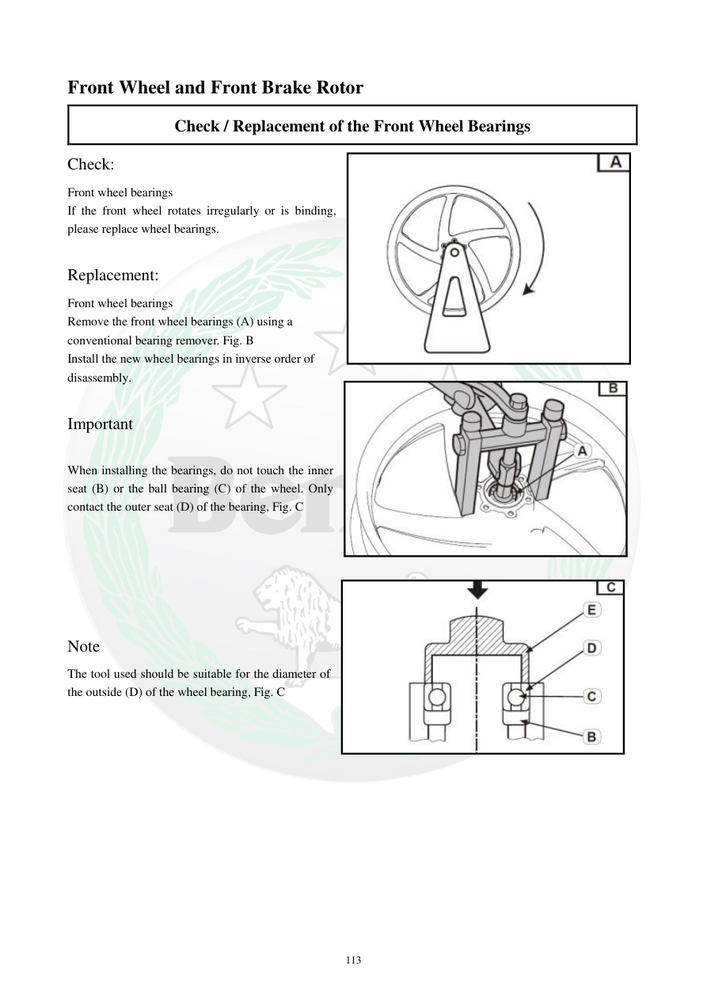

# Manual page 114

> Source: [page-0114.md](../source/page-0114.md)

## Page image / diagram

- [page-0114-img-01.jpeg](../images/embedded/page-0114-img-01.jpeg)

- [page-0114-img-02.jpeg](../images/embedded/page-0114-img-02.jpeg)

- [page-0114-img-03.jpeg](../images/embedded/page-0114-img-03.jpeg)

## Extracted text

# Source page 114

 
113 
Front Wheel and Front Brake Rotor 
Check / Replacement of the Front Wheel Bearings  
Check:  
Front wheel bearings  
If the front wheel rotates irregularly or is binding, 
please replace wheel bearings.   
 
Replacement:  
Front wheel bearings  
Remove the front wheel bearings (A) using a 
conventional bearing remover. Fig. B 
Install the new wheel bearings in inverse order of 
disassembly. 
 
Important  
 
When installing the bearings, do not touch the inner 
seat (B) or the ball bearing (C) of the wheel. Only 
contact the outer seat (D) of the bearing, Fig. C  
 
 
 
 
 
 
Note  
The tool used should be suitable for the diameter of 
the outside (D) of the wheel bearing, Fig. C

## Persian notes

<!-- Persian translation/explanation will be added here. -->
