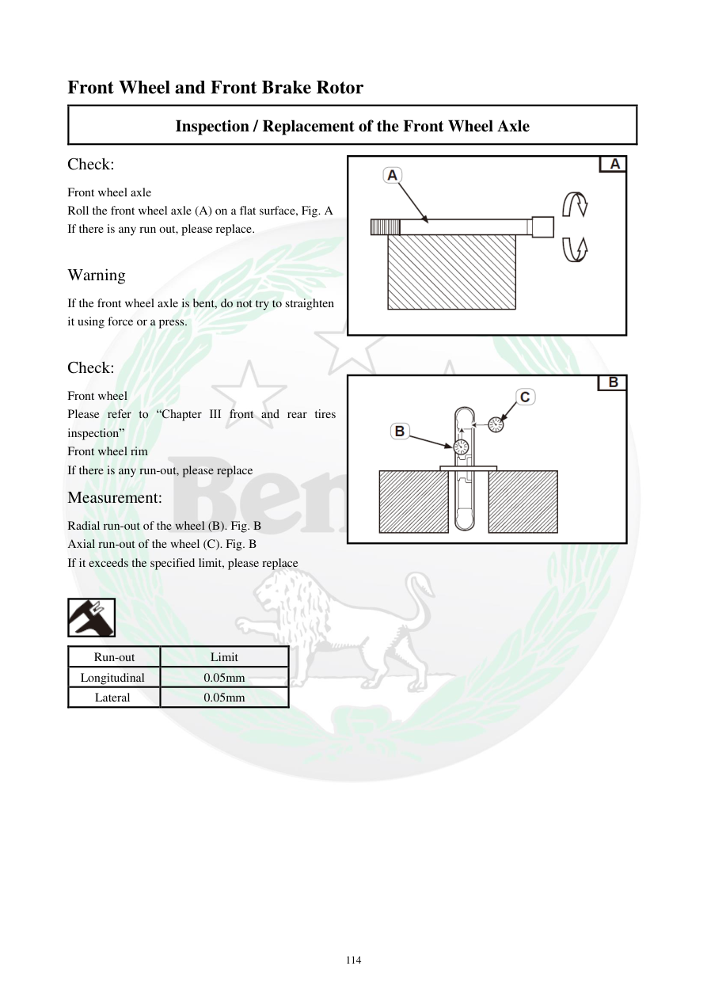

# Manual page 115

> Source: [page-0115.md](../source/page-0115.md)

## Page image / diagram

- [page-0115-img-01.png](../images/embedded/page-0115-img-01.png)

- [page-0115-img-02.png](../images/embedded/page-0115-img-02.png)

- [page-0115-img-03.png](../images/embedded/page-0115-img-03.png)

## Extracted text

# Source page 115

 
114 
Front Wheel and Front Brake Rotor 
Inspection / Replacement of the Front Wheel Axle  
Check:  
Front wheel axle  
Roll the front wheel axle (A) on a flat surface, Fig. A  
If there is any run out, please replace.  
 
Warning  
If the front wheel axle is bent, do not try to straighten 
it using force or a press.  
 
Check:  
Front wheel  
Please refer to “Chapter III front and rear tires 
inspection” 
Front wheel rim  
If there is any run-out, please replace  
Measurement:  
Radial run-out of the wheel (B). Fig. B  
Axial run-out of the wheel (C). Fig. B  
If it exceeds the specified limit, please replace  
 
 
Run-out 
Limit  
Longitudinal  
0.05mm 
Lateral  
0.05mm

## Persian notes

### محور و رینگ چرخ جلو
- محور را روی سطح صاف بغلتانید و تاب آن را بررسی کنید.
- محور خم‌شده را با فشار یا پرس صاف نکنید.
- تاب شعاعی رینگ: 0.05 mm
- تاب جانبی رینگ: 0.05 mm
- در صورت عبور از حد مشخص، قطعه طبق دفترچه تعویض شود.
