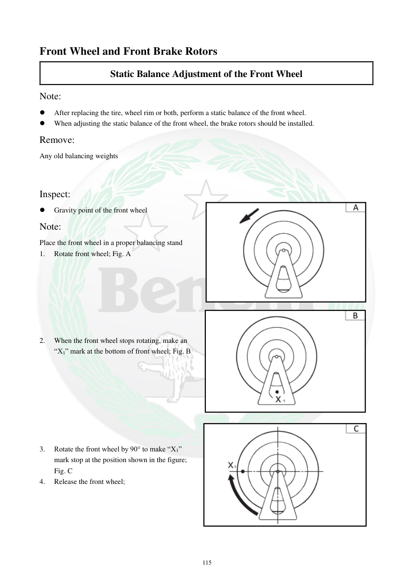

# Manual page 116

> Source: [page-0116.md](../source/page-0116.md)

## Page image / diagram

- [page-0116-img-01.png](../images/embedded/page-0116-img-01.png)

- [page-0116-img-02.png](../images/embedded/page-0116-img-02.png)

- [page-0116-img-03.png](../images/embedded/page-0116-img-03.png)

## Extracted text

# Source page 116

 
115 
Front Wheel and Front Brake Rotors 
Static Balance Adjustment of the Front Wheel  
Note:  
 
After replacing the tire, wheel rim or both, perform a static balance of the front wheel.  
 
When adjusting the static balance of the front wheel, the brake rotors should be installed.  
Remove:  
Any old balancing weights  
 
Inspect:  
 
Gravity point of the front wheel  
Note:  
Place the front wheel in a proper balancing stand  
1. 
Rotate front wheel; Fig. A  
 
 
 
 
 
 
 
2. 
When the front wheel stops rotating, make an 
“X1” mark at the bottom of front wheel; Fig. B  
 
 
 
 
 
 
 
 
3. 
Rotate the front wheel by 90° to make “X1” 
mark stop at the position shown in the figure; 
Fig. C  
4. 
Release the front wheel;

## Persian notes

### بالانس استاتیکی چرخ جلو
- پس از تعویض لاستیک یا رینگ، بالانس استاتیکی انجام شود.
- هنگام بالانس، دیسک‌های ترمز روی چرخ نصب باشند.
- وزنه‌های قبلی را خارج کنید.
- چرخ را روی پایه بالانس قرار دهید و آزادانه بچرخانید.
- پایین‌ترین نقطه توقف را با X1 علامت بزنید و مراحل نشان‌داده‌شده را ادامه دهید.
