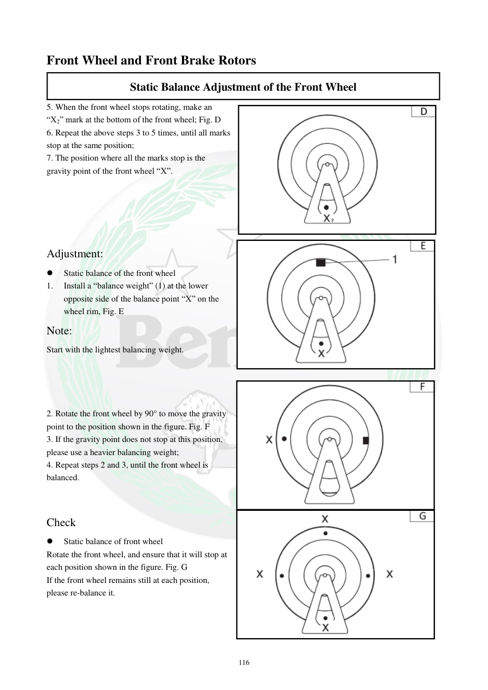

# Manual page 117

> Source: [page-0117.md](../source/page-0117.md)

## Page image / diagram

- [page-0117-img-01.png](../images/embedded/page-0117-img-01.png)

- [page-0117-img-02.png](../images/embedded/page-0117-img-02.png)

- [page-0117-img-03.png](../images/embedded/page-0117-img-03.png)

- [page-0117-img-04.png](../images/embedded/page-0117-img-04.png)

## Extracted text

# Source page 117

 
116 
Front Wheel and Front Brake Rotors 
Static Balance Adjustment of the Front Wheel 
5. When the front wheel stops rotating, make an 
“X2” mark at the bottom of the front wheel; Fig. D 
6. Repeat the above steps 3 to 5 times, until all marks 
stop at the same position;  
7. The position where all the marks stop is the 
gravity point of the front wheel “X”. 
 
 
 
 
 
Adjustment:  
 
Static balance of the front wheel  
1. 
Install a “balance weight” (1) at the lower 
opposite side of the balance point “X” on the 
wheel rim, Fig. E  
Note: 
Start with the lightest balancing weight.  
 
 
 
 
2. Rotate the front wheel by 90° to move the gravity 
point to the position shown in the figure. Fig. F 
3. If the gravity point does not stop at this position, 
please use a heavier balancing weight;  
4. Repeat steps 2 and 3, until the front wheel is 
balanced.  
 
 
Check  
 
Static balance of front wheel  
Rotate the front wheel, and ensure that it will stop at 
each position shown in the figure. Fig. G 
If the front wheel remains still at each position, 
please re-balance it.

## Persian notes

### تکمیل بالانس استاتیکی
- تعیین نقطه سنگین چرخ را چند بار تکرار کنید تا علامت‌ها در یک نقطه متوقف شوند.
- آن نقطه، نقطه گرانش چرخ X است.
- یک وزنه بالانس در سمت مقابل X نصب کنید و از سبک‌ترین وزنه شروع کنید.
- چرخ را 90 درجه بچرخانید و نتیجه را بررسی کنید.
- در صورت نیاز وزنه سنگین‌تر استفاده کنید تا چرخ متعادل شود.
