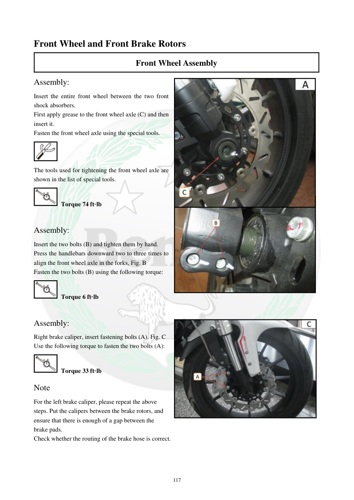

# Manual page 118

> Source: [page-0118.md](../source/page-0118.md)

## Page image / diagram

- [page-0118-img-01.png](../images/embedded/page-0118-img-01.png)

- [page-0118-img-02.png](../images/embedded/page-0118-img-02.png)

- [page-0118-img-03.jpeg](../images/embedded/page-0118-img-03.jpeg)

- [page-0118-img-04.jpeg](../images/embedded/page-0118-img-04.jpeg)

- [page-0118-img-05.jpeg](../images/embedded/page-0118-img-05.jpeg)

## Extracted text

# Source page 118

 
117 
Front Wheel and Front Brake Rotors 
Front Wheel Assembly  
Assembly:  
Insert the entire front wheel between the two front 
shock absorbers.  
First apply grease to the front wheel axle (C) and then 
insert it.  
Fasten the front wheel axle using the special tools.  
 
The tools used for tightening the front wheel axle are 
shown in the list of special tools.  
 Torque 74 ft·lb  
 
Assembly:  
Insert the two bolts (B) and tighten them by hand.  
Press the handlebars downward two to three times to 
align the front wheel axle in the forks, Fig. B  
Fasten the two bolts (B) using the following torque:  
 Torque 6 ft·lb 
 
Assembly:  
Right brake caliper, insert fastening bolts (A). Fig. C 
Use the following torque to fasten the two bolts (A):  
 Torque 33 ft·lb 
Note 
For the left brake caliper, please repeat the above 
steps. Put the calipers between the brake rotors, and 
ensure that there is enough of a gap between the 
brake pads.  
Check whether the routing of the brake hose is correct.

## Persian notes

### مونتاژ چرخ جلو
- چرخ جلو را بین دو دوشاخ قرار دهید و محور چرخ را پس از گریس‌کاری وارد کنید.
- گشتاور محور جلو: **74 ft·lb**.
- پس از قرار دادن پیچ‌های گیره، فرمان را ۲ تا ۳ بار به پایین فشار دهید تا محور در دوشاخ‌ها هم‌راستا شود.
- گشتاور پیچ‌های گیره محور: **6 ft·lb**.
- گشتاور پیچ‌های کالیپر جلو: **33 ft·lb**.
- کالیپر را بین دیسک‌ها قرار دهید و از وجود فاصله کافی بین لنت‌ها مطمئن شوید.
- مسیر شلنگ ترمز باید صحیح باشد.
