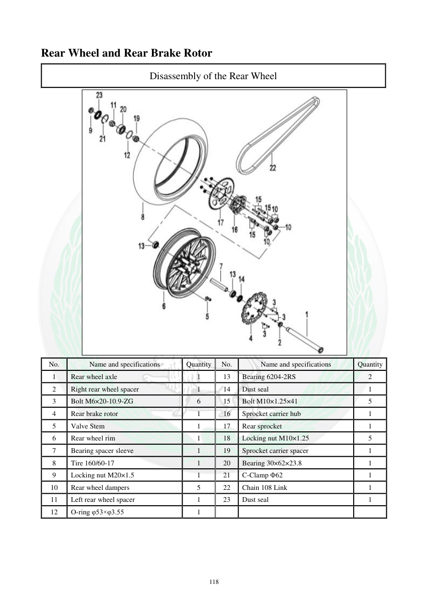

# Manual page 119

> Source: [page-0119.md](../source/page-0119.md)

## Page image / diagram

- [page-0119-img-01.jpeg](../images/embedded/page-0119-img-01.jpeg)

## Extracted text

# Source page 119

 
118 
Rear Wheel and Rear Brake Rotor 
Disassembly of the Rear Wheel  
 
No.  
Name and specifications  
Quantity 
No.  
Name and specifications  
Quantity 
1 
Rear wheel axle  
1 
13 
Bearing 6204-2RS 
2 
2 
Right rear wheel spacer  
1 
14 
Dust seal  
1 
3 
Bolt M6×20-10.9-ZG 
6 
15 
Bolt M10×1.25×41 
5 
4 
Rear brake rotor  
1 
16 
Sprocket carrier hub  
1 
5 
Valve Stem  
1 
17 
Rear sprocket 
1 
6 
Rear wheel rim  
1 
18 
Locking nut M10×1.25 
5 
7 
Bearing spacer sleeve  
1 
19 
Sprocket carrier spacer  
1 
8 
Tire 160/60-17 
1 
20 
Bearing 30×62×23.8 
1 
9 
Locking nut M20×1.5 
1 
21 
C-Clamp Φ62 
1 
10 
Rear wheel dampers  
5 
22 
Chain 108 Link  
1 
11 
Left rear wheel spacer  
1 
23 
Dust seal  
1 
12 
O-ring φ53×φ3.55 
1

## Persian notes

### اجزای چرخ عقب
- لاستیک عقب: **160/60-17**.
- بلبرینگ 6204-2RS: تعداد ۲ عدد.
- بلبرینگ دیگر مجموعه: **30×62×23.8**.
- زنجیر: **108 Link**.
- رینگ عقب، محور، فاصله‌دهنده‌ها، توپی حامل چرخ‌زنجیر و دمپرهای چرخ عقب نیز در جدول قطعات مشخص شده‌اند.
- O-ring درج‌شده در جدول: **φ53×φ3.55**.
