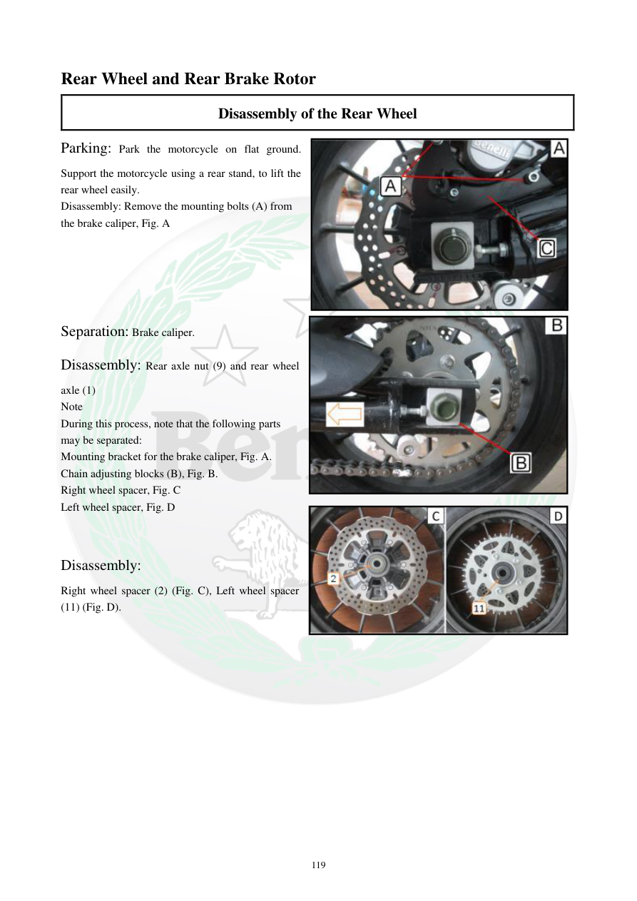

# Manual page 120

> Source: [page-0120.md](../source/page-0120.md)

## Page image / diagram

- [page-0120-img-01.jpeg](../images/embedded/page-0120-img-01.jpeg)

- [page-0120-img-02.jpeg](../images/embedded/page-0120-img-02.jpeg)

- [page-0120-img-03.jpeg](../images/embedded/page-0120-img-03.jpeg)

## Extracted text

# Source page 120

 
119 
Rear Wheel and Rear Brake Rotor 
Disassembly of the Rear Wheel 
Parking: Park the motorcycle on flat ground. 
Support the motorcycle using a rear stand, to lift the 
rear wheel easily.  
Disassembly: Remove the mounting bolts (A) from 
the brake caliper, Fig. A 
 
 
 
 
 
Separation: Brake caliper.  
Disassembly: Rear axle nut (9) and rear wheel 
axle (1) 
Note 
During this process, note that the following parts 
may be separated:  
Mounting bracket for the brake caliper, Fig. A.  
Chain adjusting blocks (B), Fig. B.  
Right wheel spacer, Fig. C 
Left wheel spacer, Fig. D 
 
 
Disassembly:  
Right wheel spacer (2) (Fig. C), Left wheel spacer 
(11) (Fig. D).

## Persian notes

<!-- Persian translation/explanation will be added here. -->
