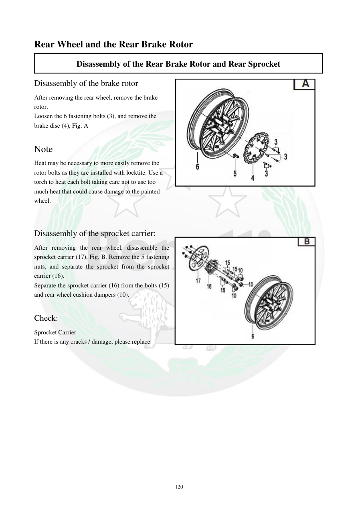

# Manual page 121

> Source: [page-0121.md](../source/page-0121.md)

## Page image / diagram

- [page-0121-img-01.jpeg](../images/embedded/page-0121-img-01.jpeg)

- [page-0121-img-02.jpeg](../images/embedded/page-0121-img-02.jpeg)

## Extracted text

# Source page 121

 
120 
Rear Wheel and the Rear Brake Rotor 
Disassembly of the Rear Brake Rotor and Rear Sprocket 
Disassembly of the brake rotor  
After removing the rear wheel, remove the brake 
rotor.  
Loosen the 6 fastening bolts (3), and remove the 
brake disc (4), Fig. A 
 
Note  
Heat may be necessary to more easily remove the 
rotor bolts as they are installed with locktite. Use a 
torch to heat each bolt taking care not to use too 
much heat that could cause damage to the painted  
wheel. 
 
 
Disassembly of the sprocket carrier: 
After removing the rear wheel, disassemble the 
sprocket carrier (17), Fig. B. Remove the 5 fastening 
nuts, and separate the sprocket from the sprocket 
carrier (16).  
Separate the sprocket carrier (16) from the bolts (15) 
and rear wheel cushion dampers (10).  
 
Check:  
Sprocket Carrier 
If there is any cracks / damage, please replace

## Persian notes

### دیسک ترمز و چرخ‌زنجیر عقب
- پس از خارج‌کردن چرخ عقب، ۶ پیچ اتصال دیسک را باز و دیسک را جدا کنید.
- پیچ‌ها با قفل رزوه نصب شده‌اند و ممکن است برای بازشدن به گرم‌کردن کنترل‌شده نیاز داشته باشند. مراقب رنگ رینگ باشید.
- برای جداکردن حامل چرخ‌زنجیر، ۵ مهره اتصال را باز کنید و چرخ‌زنجیر را از حامل جدا کنید.
- حامل را از پیچ‌ها و دمپرهای چرخ عقب جدا کنید.
- حامل چرخ‌زنجیر را از نظر ترک و آسیب بررسی کنید و در صورت وجود، تعویض شود.
