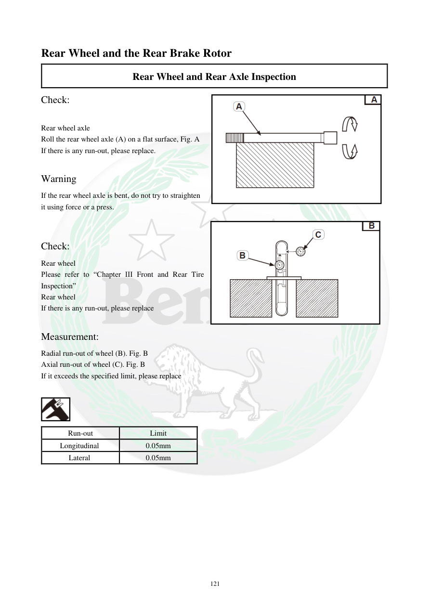

# Manual page 122

> Source: [page-0122.md](../source/page-0122.md)

## Page image / diagram

## Extracted text

# Source page 122

 
121 
Rear Wheel and the Rear Brake Rotor  
Rear Wheel and Rear Axle Inspection  
Check:  
 
Rear wheel axle  
Roll the rear wheel axle (A) on a flat surface, Fig. A  
If there is any run-out, please replace.  
 
Warning 
If the rear wheel axle is bent, do not try to straighten 
it using force or a press.  
 
 
Check: 
Rear wheel  
Please refer to “Chapter III Front and Rear Tire 
Inspection”  
Rear wheel  
If there is any run-out, please replace  
 
Measurement: 
Radial run-out of wheel (B). Fig. B  
Axial run-out of wheel (C). Fig. B  
If it exceeds the specified limit, please replace  
 
 
Run-out 
Limit  
Longitudinal  
0.05mm 
Lateral  
0.05mm

## Persian notes

<!-- Persian translation/explanation will be added here. -->
