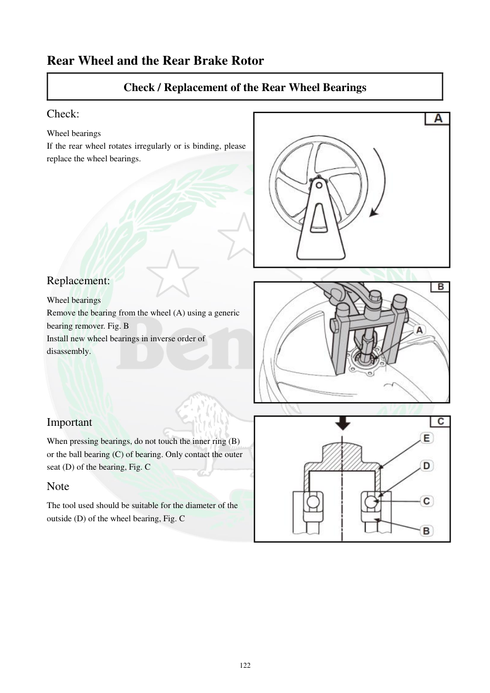

# Manual page 123

> Source: [page-0123.md](../source/page-0123.md)

## Page image / diagram

- [page-0123-img-01.jpeg](../images/embedded/page-0123-img-01.jpeg)

- [page-0123-img-02.jpeg](../images/embedded/page-0123-img-02.jpeg)

- [page-0123-img-03.jpeg](../images/embedded/page-0123-img-03.jpeg)

## Extracted text

# Source page 123

 
122 
Rear Wheel and the Rear Brake Rotor 
Check / Replacement of the Rear Wheel Bearings 
Check: 
Wheel bearings  
If the rear wheel rotates irregularly or is binding, please 
replace the wheel bearings.   
 
 
 
 
 
 
 
 
Replacement: 
Wheel bearings  
Remove the bearing from the wheel (A) using a generic 
bearing remover. Fig. B 
Install new wheel bearings in inverse order of 
disassembly. 
 
 
 
 
Important  
When pressing bearings, do not touch the inner ring (B) 
or the ball bearing (C) of bearing. Only contact the outer 
seat (D) of the bearing, Fig. C  
Note 
The tool used should be suitable for the diameter of the 
outside (D) of the wheel bearing, Fig. C

## Persian notes

<!-- Persian translation/explanation will be added here. -->
