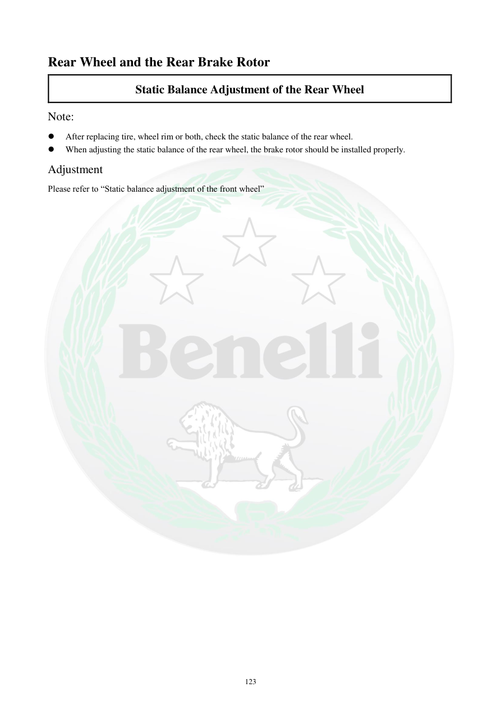

# Manual page 124

> Source: [page-0124.md](../source/page-0124.md)

## Page image / diagram

## Extracted text

# Source page 124

 
123 
Rear Wheel and the Rear Brake Rotor 
Static Balance Adjustment of the Rear Wheel 
Note:  
 
After replacing tire, wheel rim or both, check the static balance of the rear wheel.  
 
When adjusting the static balance of the rear wheel, the brake rotor should be installed properly.  
Adjustment  
Please refer to “Static balance adjustment of the front wheel”

## Persian notes

### بالانس استاتیکی چرخ عقب
- پس از تعویض لاستیک یا رینگ، بالانس استاتیکی چرخ عقب بررسی شود.
- هنگام تنظیم، دیسک ترمز باید به‌درستی روی چرخ نصب باشد.
- روش تنظیم همان روش **بالانس استاتیکی چرخ جلو** است که در صفحات قبلی توضیح داده شده.
