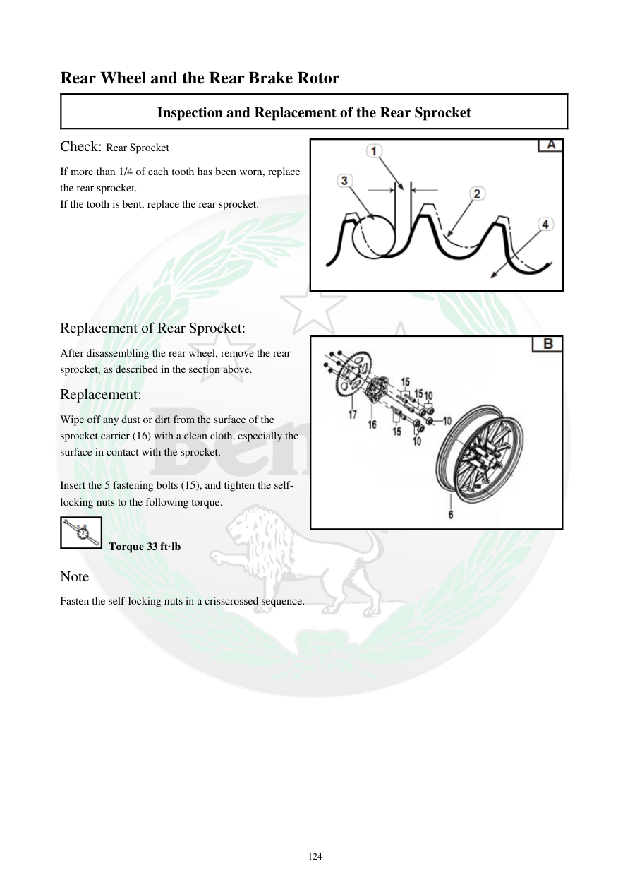

# Manual page 125

> Source: [page-0125.md](../source/page-0125.md)

## Page image / diagram

- [page-0125-img-02.png](../images/embedded/page-0125-img-02.png)

- [page-0125-img-03.jpeg](../images/embedded/page-0125-img-03.jpeg)

## Extracted text

# Source page 125

 
124 
Rear Wheel and the Rear Brake Rotor 
Inspection and Replacement of the Rear Sprocket 
Check: Rear Sprocket  
If more than 1/4 of each tooth has been worn, replace 
the rear sprocket. 
If the tooth is bent, replace the rear sprocket.  
 
 
 
 
 
 
Replacement of Rear Sprocket:  
After disassembling the rear wheel, remove the rear 
sprocket, as described in the section above.  
Replacement:  
Wipe off any dust or dirt from the surface of the 
sprocket carrier (16) with a clean cloth, especially the 
surface in contact with the sprocket.  
 
Insert the 5 fastening bolts (15), and tighten the self-
locking nuts to the following torque.  
 Torque 33 ft·lb 
Note  
Fasten the self-locking nuts in a crisscrossed sequence.

## Persian notes

### بررسی و تعویض چرخ‌زنجیر عقب
- اگر بیش از **یک‌چهارم ارتفاع هر دندانه** ساییده شده باشد، چرخ‌زنجیر را تعویض کنید.
- دندانه خم‌شده نیز دلیل تعویض است.
- سطح حامل چرخ‌زنجیر را به‌خصوص محل تماس با چرخ‌زنجیر کاملاً تمیز کنید.
- ۵ پیچ اتصال را نصب و مهره‌های قفل‌شونده را به صورت ضربدری سفت کنید.
- گشتاور مهره‌ها: **33 ft·lb**.
