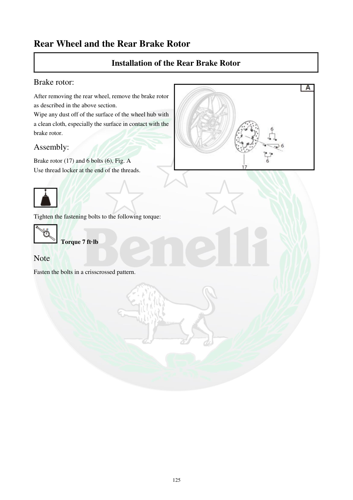

# Manual page 126

> Source: [page-0126.md](../source/page-0126.md)

## Page image / diagram

- [page-0126-img-01.png](../images/embedded/page-0126-img-01.png)

- [page-0126-img-02.png](../images/embedded/page-0126-img-02.png)

- [page-0126-img-03.jpeg](../images/embedded/page-0126-img-03.jpeg)

## Extracted text

# Source page 126

 
125 
Rear Wheel and the Rear Brake Rotor 
Installation of the Rear Brake Rotor  
Brake rotor:  
After removing the rear wheel, remove the brake rotor 
as described in the above section.  
Wipe any dust off of the surface of the wheel hub with 
a clean cloth, especially the surface in contact with the 
brake rotor.  
Assembly:  
Brake rotor (17) and 6 bolts (6), Fig. A  
Use thread locker at the end of the threads.  
 
 
Tighten the fastening bolts to the following torque: 
 Torque 7 ft·lb  
Note   
Fasten the bolts in a crisscrossed pattern.

## Persian notes

<!-- Persian translation/explanation will be added here. -->
