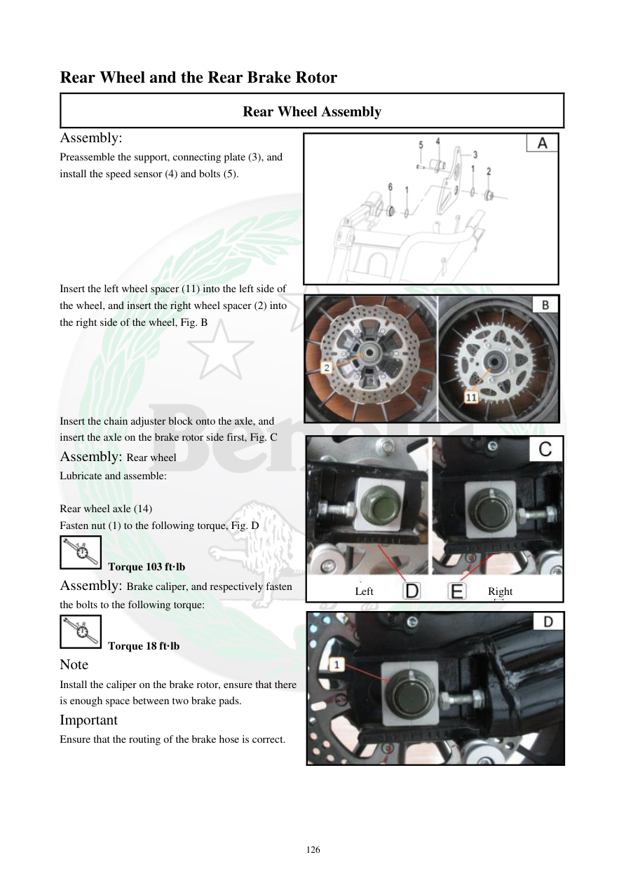

# Manual page 127

> Source: [page-0127.md](../source/page-0127.md)

## Page image / diagram

- [page-0127-img-03.png](../images/embedded/page-0127-img-03.png)

- [page-0127-img-04.jpeg](../images/embedded/page-0127-img-04.jpeg)

- [page-0127-img-05.jpeg](../images/embedded/page-0127-img-05.jpeg)

- [page-0127-img-06.jpeg](../images/embedded/page-0127-img-06.jpeg)

## Extracted text

# Source page 127

 
126 
Rear Wheel and the Rear Brake Rotor 
Rear Wheel Assembly 
Assembly:  
Preassemble the support, connecting plate (3), and 
install the speed sensor (4) and bolts (5).  
 
 
 
 
 
 
Insert the left wheel spacer (11) into the left side of 
the wheel, and insert the right wheel spacer (2) into 
the right side of the wheel, Fig. B  
 
 
 
 
 
Insert the chain adjuster block onto the axle, and 
insert the axle on the brake rotor side first, Fig. C  
Assembly: Rear wheel  
Lubricate and assemble:  
 
Rear wheel axle (14) 
Fasten nut (1) to the following torque, Fig. D  
 Torque 103 ft·lb 
Assembly: Brake caliper, and respectively fasten 
the bolts to the following torque:  
 Torque 18 ft·lb 
Note 
Install the caliper on the brake rotor, ensure that there 
is enough space between two brake pads.  
Important  
Ensure that the routing of the brake hose is correct.  
 
Right 
Left

## Persian notes

<!-- Persian translation/explanation will be added here. -->
