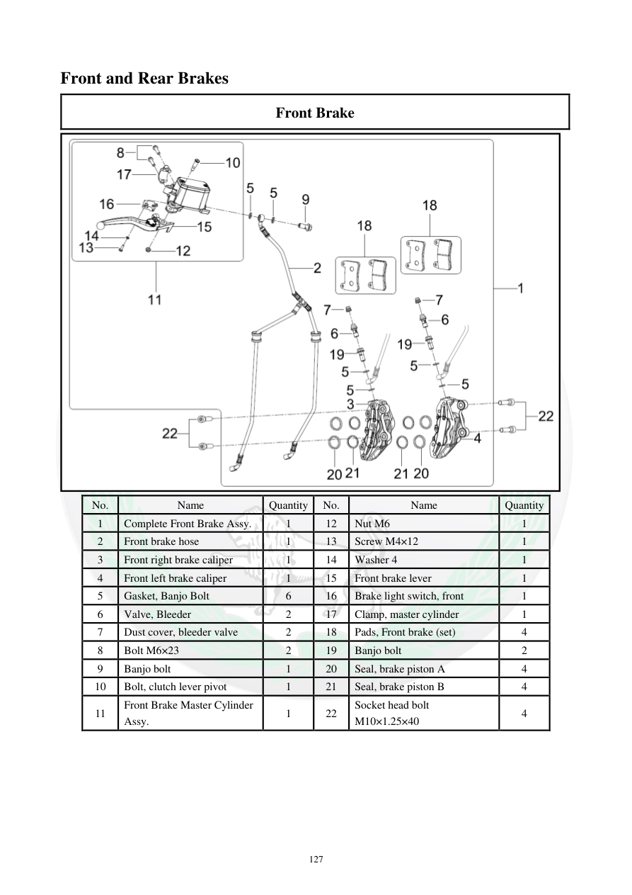

# Manual page 128

> Source: [page-0128.md](../source/page-0128.md)

## Page image / diagram

- [page-0128-img-02.png](../images/embedded/page-0128-img-02.png)

## Extracted text

# Source page 128

 
127 
Front and Rear Brakes  
Front Brake  
 
No. 
Name 
Quantity 
No. 
Name 
Quantity 
1 
Complete Front Brake Assy.  
1 
12 
Nut M6 
1 
2 
Front brake hose  
1 
13 
Screw M4×12  
1 
3 
Front right brake caliper  
1 
14 
Washer 4 
1 
4 
Front left brake caliper 
1 
15 
Front brake lever  
1 
5 
Gasket, Banjo Bolt 
6 
16 
Brake light switch, front  
1 
6 
Valve, Bleeder  
2 
17 
Clamp, master cylinder  
1 
7 
Dust cover, bleeder valve  
2 
18 
Pads, Front brake (set) 
4 
8 
Bolt M6×23 
2 
19 
Banjo bolt  
2 
9 
Banjo bolt 
1 
20 
Seal, brake piston A  
4 
10 
Bolt, clutch lever pivot 
1 
21 
Seal, brake piston B 
4 
11 
Front Brake Master Cylinder 
Assy. 
1 
22 
Socket head bolt 
M10×1.25×40 
4

## Persian notes

### مجموعه ترمز جلو
این صفحه فهرست قطعات مجموعه ترمز جلو را نشان می‌دهد، از جمله کالیپرهای راست و چپ، شلنگ ترمز، پمپ ترمز، اهرم، کلید چراغ ترمز، لنت‌ها، پیچ بانجو و آب‌بندی پیستون‌ها. برای شناسایی قطعات هنگام تعمیر، تصویر صفحه مرجع اصلی است.
