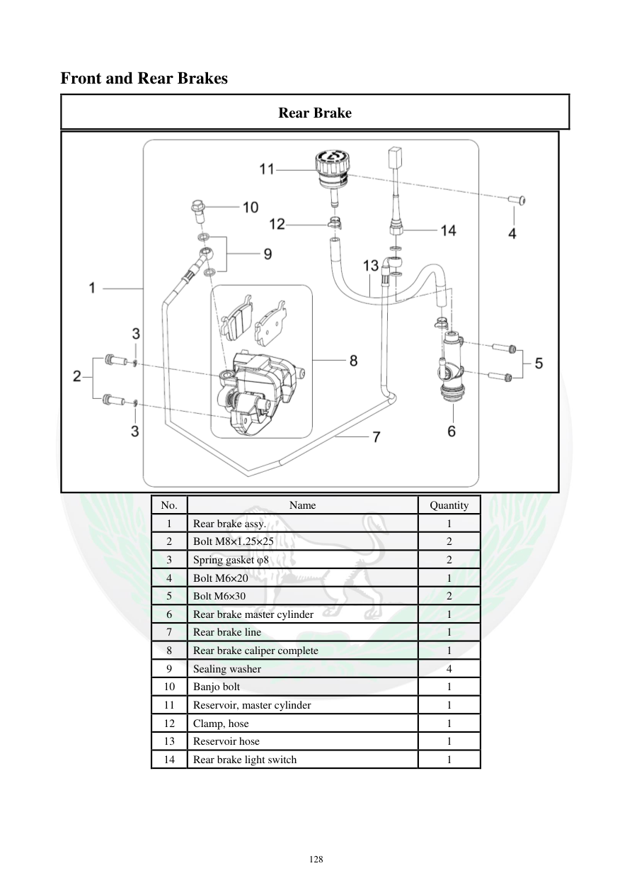

# Manual page 129

> Source: [page-0129.md](../source/page-0129.md)

## Page image / diagram

- [page-0129-img-02.png](../images/embedded/page-0129-img-02.png)

## Extracted text

# Source page 129

 
128 
Front and Rear Brakes  
Rear Brake  
 
No.  
Name  
Quantity  
1 
Rear brake assy. 
1 
2 
Bolt M8×1.25×25 
2 
3 
Spring gasket φ8 
2 
4 
Bolt M6×20 
1 
5 
Bolt M6×30 
2 
6 
Rear brake master cylinder  
1 
7 
Rear brake line  
1 
8 
Rear brake caliper complete  
1 
9 
Sealing washer  
4 
10 
Banjo bolt  
1 
11 
Reservoir, master cylinder  
1 
12 
Clamp, hose 
1 
13 
Reservoir hose  
1 
14 
Rear brake light switch  
1

## Persian notes

### مجموعه ترمز عقب
فهرست قطعات شامل پمپ ترمز عقب، شلنگ و خط ترمز، کالیپر، مخزن روغن، شلنگ مخزن، کلید چراغ ترمز و واشرهای آب‌بندی است. مشخصات پیچ‌ها در جدول اصلی حفظ شده و برای مونتاژ باید با تصویر تطبیق داده شوند.
