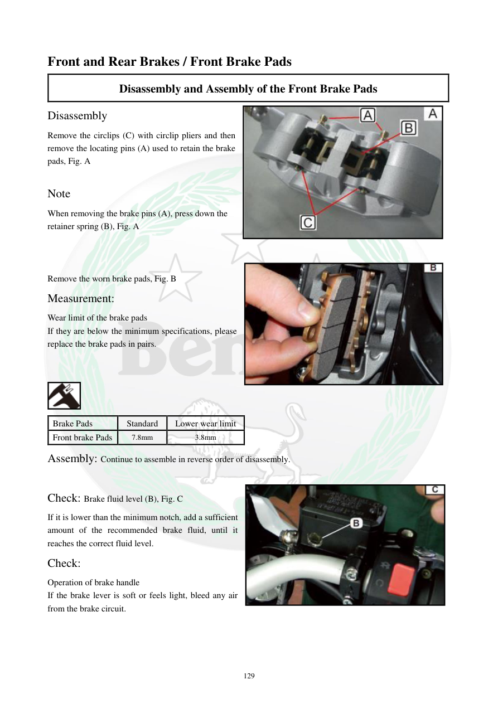

# Manual page 130

> Source: [page-0130.md](../source/page-0130.md)

## Page image / diagram

- [page-0130-img-01.png](../images/embedded/page-0130-img-01.png)

- [page-0130-img-02.jpeg](../images/embedded/page-0130-img-02.jpeg)

- [page-0130-img-03.jpeg](../images/embedded/page-0130-img-03.jpeg)

- [page-0130-img-04.jpeg](../images/embedded/page-0130-img-04.jpeg)

## Extracted text

# Source page 130

 
129 
Front and Rear Brakes / Front Brake Pads  
Disassembly and Assembly of the Front Brake Pads  
Disassembly 
Remove the circlips (C) with circlip pliers and then 
remove the locating pins (A) used to retain the brake 
pads, Fig. A  
 
Note  
When removing the brake pins (A), press down the 
retainer spring (B), Fig. A  
 
 
 
Remove the worn brake pads, Fig. B  
Measurement:  
Wear limit of the brake pads  
If they are below the minimum specifications, please 
replace the brake pads in pairs.  
 
 
 
Brake Pads  
Standard  
Lower wear limit  
Front brake Pads  
7.8mm 
3.8mm 
Assembly: Continue to assemble in reverse order of disassembly.  
 
Check: Brake fluid level (B), Fig. C  
If it is lower than the minimum notch, add a sufficient 
amount of the recommended brake fluid, until it 
reaches the correct fluid level.  
Check:  
Operation of brake handle  
If the brake lever is soft or feels light, bleed any air 
from the brake circuit.

## Persian notes

<!-- Persian translation/explanation will be added here. -->
