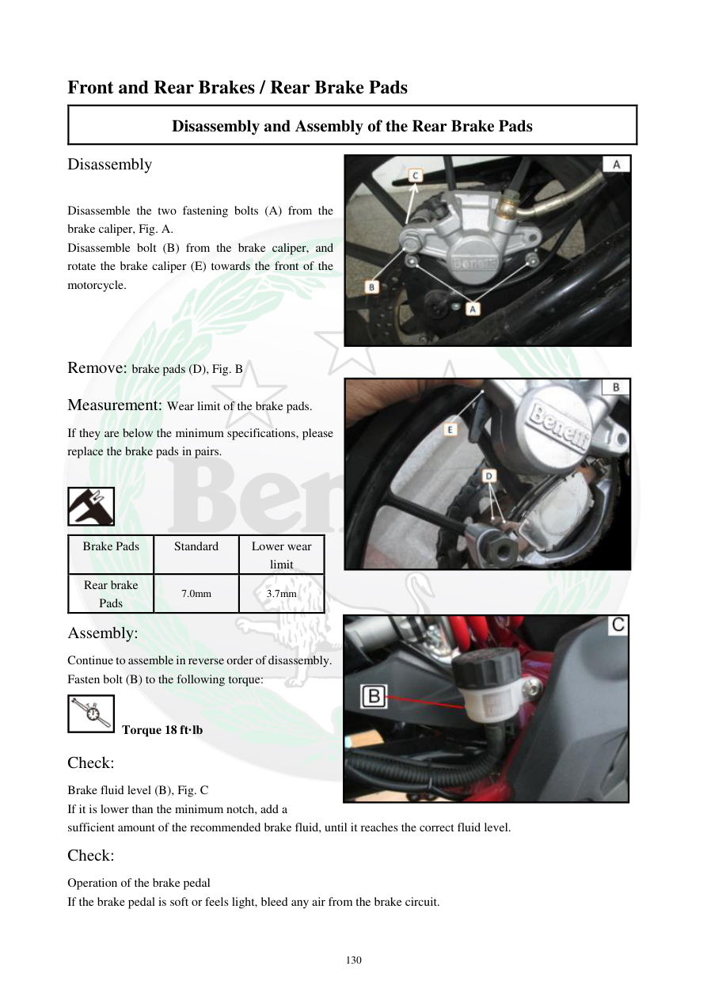

# Manual page 131

> Source: [page-0131.md](../source/page-0131.md)

## Page image / diagram

- [page-0131-img-03.jpeg](../images/embedded/page-0131-img-03.jpeg)

- [page-0131-img-04.jpeg](../images/embedded/page-0131-img-04.jpeg)

- [page-0131-img-05.jpeg](../images/embedded/page-0131-img-05.jpeg)

## Extracted text

# Source page 131

 
130 
Front and Rear Brakes / Rear Brake Pads  
Disassembly and Assembly of the Rear Brake Pads 
Disassembly 
 
Disassemble the two fastening bolts (A) from the 
brake caliper, Fig. A.  
Disassemble bolt (B) from the brake caliper, and 
rotate the brake caliper (E) towards the front of the 
motorcycle.  
 
 
 
Remove: brake pads (D), Fig. B  
Measurement: Wear limit of the brake pads.  
If they are below the minimum specifications, please 
replace the brake pads in pairs.  
 
 
Brake Pads 
Standard  
Lower wear 
limit  
Rear brake 
Pads 
7.0mm 
3.7mm 
Assembly:  
Continue to assemble in reverse order of disassembly.  
Fasten bolt (B) to the following torque:  
 Torque 18 ft·lb 
Check:  
Brake fluid level (B), Fig. C  
If it is lower than the minimum notch, add a 
sufficient amount of the recommended brake fluid, until it reaches the correct fluid level.  
Check:  
Operation of the brake pedal  
If the brake pedal is soft or feels light, bleed any air from the brake circuit.

## Persian notes

### تعویض لنت ترمز عقب
- دو پیچ اتصال کالیپر **A** را باز کنید.
- پیچ **B** را باز کرده و کالیپر **E** را به سمت جلوی موتور بچرخانید.
- لنت‌های **D** را خارج کنید.
- ضخامت استاندارد لنت عقب: **7.0 mm**
- حد سایش: **3.7 mm**
- در صورت رسیدن به حد سایش، لنت‌ها را جفتی تعویض کنید.
- گشتاور پیچ **B**: **18 ft·lb**
- سطح روغن ترمز و عملکرد پدال را بررسی کنید. پدال نرم یا سبک نیاز به هواگیری مدار دارد.
