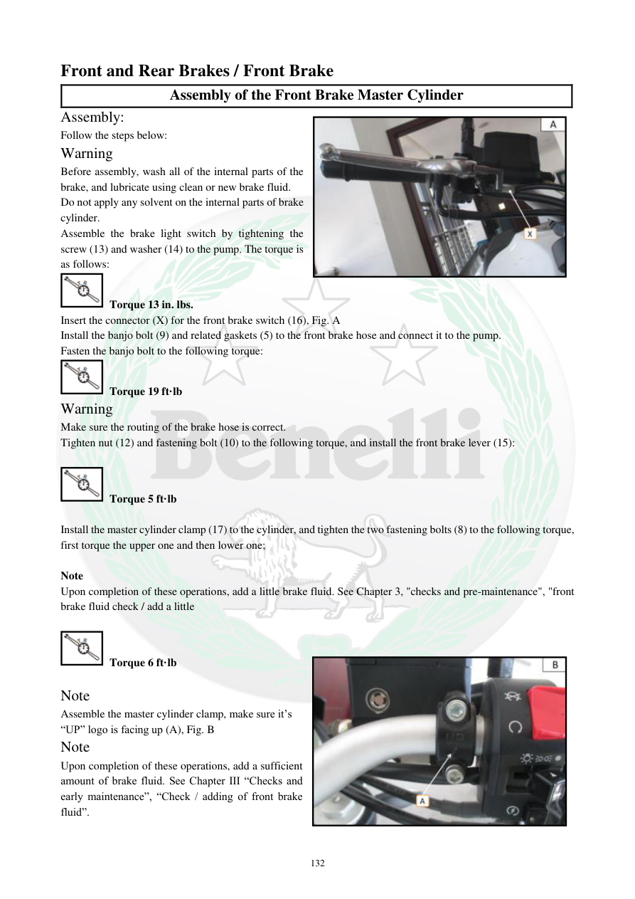

# Manual page 133

> Source: [page-0133.md](../source/page-0133.md)

## Page image / diagram

- [page-0133-img-02.jpeg](../images/embedded/page-0133-img-02.jpeg)

- [page-0133-img-03.jpeg](../images/embedded/page-0133-img-03.jpeg)

## Extracted text

# Source page 133

 
132 
Front and Rear Brakes / Front Brake  
Assembly of the Front Brake Master Cylinder  
Assembly:  
Follow the steps below:  
Warning  
Before assembly, wash all of the internal parts of the 
brake, and lubricate using clean or new brake fluid.  
Do not apply any solvent on the internal parts of brake 
cylinder.  
Assemble the brake light switch by tightening the 
screw (13) and washer (14) to the pump. The torque is 
as follows:  
 Torque 13 in. lbs. 
Insert the connector (X) for the front brake switch (16), Fig. A  
Install the banjo bolt (9) and related gaskets (5) to the front brake hose and connect it to the pump.  
Fasten the banjo bolt to the following torque:  
 Torque 19 ft·lb 
Warning  
Make sure the routing of the brake hose is correct. 
Tighten nut (12) and fastening bolt (10) to the following torque, and install the front brake lever (15): 
 
 Torque 5 ft·lb 
 
Install the master cylinder clamp (17) to the cylinder, and tighten the two fastening bolts (8) to the following torque, 
first torque the upper one and then lower one;  
 
Note 
Upon completion of these operations, add a little brake fluid. See Chapter 3, "checks and pre-maintenance", "front 
brake fluid check / add a little 
 
 Torque 6 ft·lb 
 
Note 
Assemble the master cylinder clamp, make sure it’s 
“UP” logo is facing up (A), Fig. B 
Note  
Upon completion of these operations, add a sufficient 
amount of brake fluid. See Chapter III “Checks and 
early maintenance”, “Check / adding of front brake 
fluid”.

## Persian notes

<!-- Persian translation/explanation will be added here. -->
