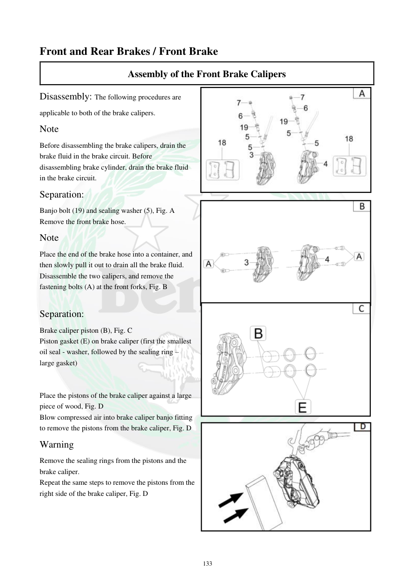

# Manual page 134

> Source: [page-0134.md](../source/page-0134.md)

## Page image / diagram

- [page-0134-img-01.jpeg](../images/embedded/page-0134-img-01.jpeg)

- [page-0134-img-02.png](../images/embedded/page-0134-img-02.png)

- [page-0134-img-03.png](../images/embedded/page-0134-img-03.png)

- [page-0134-img-04.jpeg](../images/embedded/page-0134-img-04.jpeg)

## Extracted text

# Source page 134

 
133 
Front and Rear Brakes / Front Brake 
Assembly of the Front Brake Calipers  
Disassembly: The following procedures are 
applicable to both of the brake calipers.  
Note 
Before disassembling the brake calipers, drain the 
brake fluid in the brake circuit. Before 
disassembling brake cylinder, drain the brake fluid 
in the brake circuit.  
Separation: 
Banjo bolt (19) and sealing washer (5), Fig. A  
Remove the front brake hose.  
Note  
Place the end of the brake hose into a container, and 
then slowly pull it out to drain all the brake fluid.  
Disassemble the two calipers, and remove the 
fastening bolts (A) at the front forks, Fig. B  
 
Separation: 
Brake caliper piston (B), Fig. C 
Piston gasket (E) on brake caliper (first the smallest 
oil seal - washer, followed by the sealing ring – 
large gasket) 
 
 
Place the pistons of the brake caliper against a large 
piece of wood, Fig. D  
Blow compressed air into brake caliper banjo fitting 
to remove the pistons from the brake caliper, Fig. D  
Warning  
Remove the sealing rings from the pistons and the 
brake caliper.  
Repeat the same steps to remove the pistons from the 
right side of the brake caliper, Fig. D

## Persian notes

### بازکردن کالیپر ترمز جلو
- این روش برای هر دو کالیپر جلو کاربرد دارد.
- قبل از بازکردن کالیپر، روغن ترمز مدار را تخلیه کنید.
- پیچ بانجو و واشر آب‌بندی را باز و شلنگ ترمز را جدا کنید.
- انتهای شلنگ را داخل ظرف قرار دهید تا روغن باقی‌مانده تخلیه شود.
- پیچ‌های اتصال کالیپر به دوشاخ را باز کنید.
- برای خارج‌کردن پیستون‌ها، آن‌ها را مقابل یک قطعه چوب بزرگ قرار دهید و طبق دستور دفترچه از هوای فشرده از محل اتصال بانجو استفاده کنید.
- آب‌بندی‌های پیستون و کالیپر را خارج کنید و از قطعات آسیب‌دیده استفاده مجدد نکنید.
