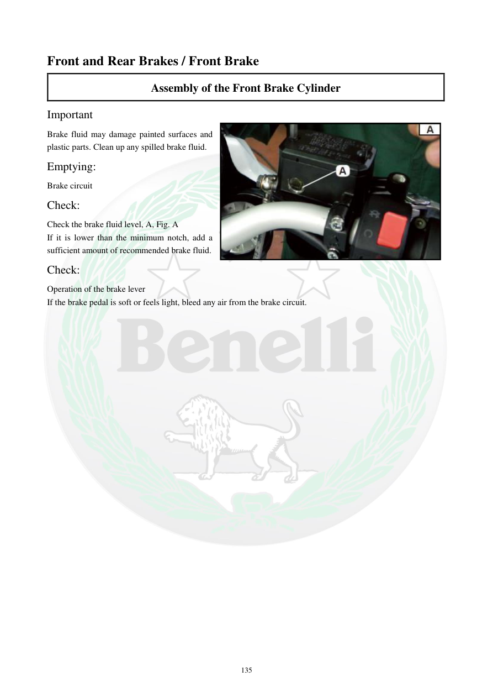

# Manual page 136

> Source: [page-0136.md](../source/page-0136.md)

## Page image / diagram

- [page-0136-img-01.jpeg](../images/embedded/page-0136-img-01.jpeg)

## Extracted text

# Source page 136

 
135 
Front and Rear Brakes / Front Brake 
Assembly of the Front Brake Cylinder 
Important  
Brake fluid may damage painted surfaces and 
plastic parts. Clean up any spilled brake fluid.  
Emptying:  
Brake circuit  
Check:  
Check the brake fluid level, A, Fig. A 
If it is lower than the minimum notch, add a 
sufficient amount of recommended brake fluid.  
Check:  
Operation of the brake lever  
If the brake pedal is soft or feels light, bleed any air from the brake circuit.

## Persian notes

<!-- Persian translation/explanation will be added here. -->
