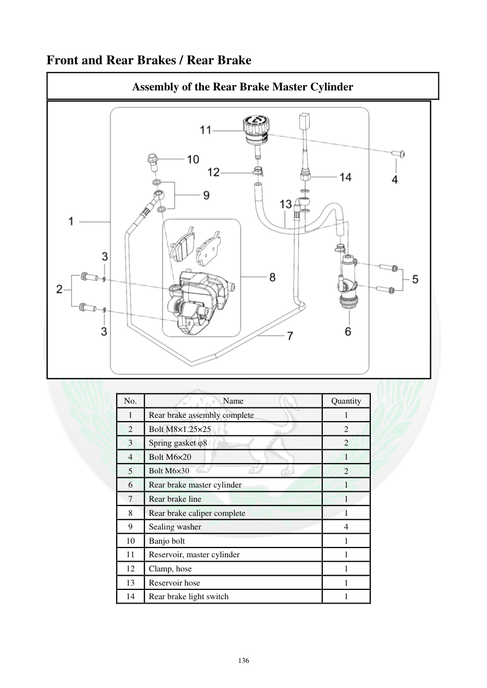

# Manual page 137

> Source: [page-0137.md](../source/page-0137.md)

## Page image / diagram

## Extracted text

# Source page 137

 
136 
Front and Rear Brakes / Rear Brake 
Assembly of the Rear Brake Master Cylinder  
 
 
No.  
Name  
Quantity  
1 
Rear brake assembly complete 
1 
2 
Bolt M8×1.25×25 
2 
3 
Spring gasket φ8 
2 
4 
Bolt M6×20 
1 
5 
Bolt M6×30 
2 
6 
Rear brake master cylinder  
1 
7 
Rear brake line  
1 
8 
Rear brake caliper complete  
1 
9 
Sealing washer  
4 
10 
Banjo bolt  
1 
11 
Reservoir, master cylinder  
1 
12 
Clamp, hose 
1 
13 
Reservoir hose  
1 
14 
Rear brake light switch  
1

## Persian notes

### مجموعه پمپ ترمز عقب
این صفحه فهرست قطعات مجموعه پمپ ترمز عقب را ثبت می‌کند، شامل پمپ اصلی، مخزن، شلنگ مخزن، خط ترمز، کالیپر، کلید چراغ ترمز، پیچ‌ها و واشرهای آب‌بندی. برای محل دقیق قطعات، تصویر صفحه مرجع اصلی است.
