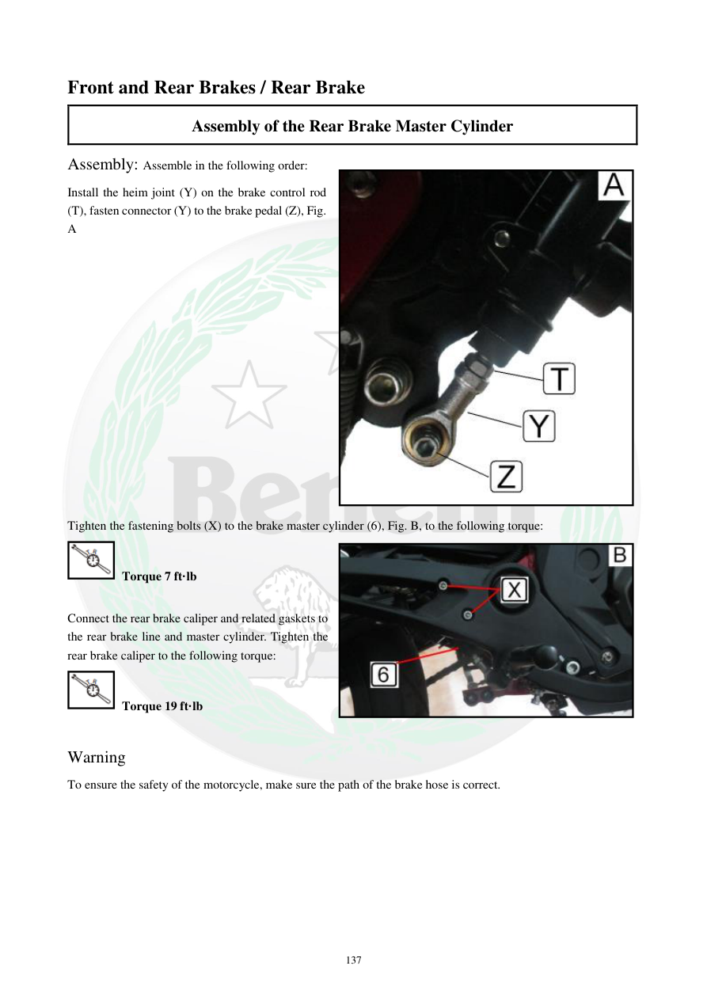

# Manual page 138

> Source: [page-0138.md](../source/page-0138.md)

## Page image / diagram

- [page-0138-img-02.jpeg](../images/embedded/page-0138-img-02.jpeg)

- [page-0138-img-03.jpeg](../images/embedded/page-0138-img-03.jpeg)

## Extracted text

# Source page 138

 
137 
Front and Rear Brakes / Rear Brake 
Assembly of the Rear Brake Master Cylinder 
Assembly: Assemble in the following order:  
Install the heim joint (Y) on the brake control rod 
(T), fasten connector (Y) to the brake pedal (Z), Fig. 
A  
 
 
 
 
 
 
 
 
 
 
 
 
 
 
 
Tighten the fastening bolts (X) to the brake master cylinder (6), Fig. B, to the following torque:  
 Torque 7 ft·lb 
 
Connect the rear brake caliper and related gaskets to 
the rear brake line and master cylinder. Tighten the 
rear brake caliper to the following torque:  
 Torque 19 ft·lb 
 
Warning  
To ensure the safety of the motorcycle, make sure the path of the brake hose is correct.

## Persian notes

<!-- Persian translation/explanation will be added here. -->
