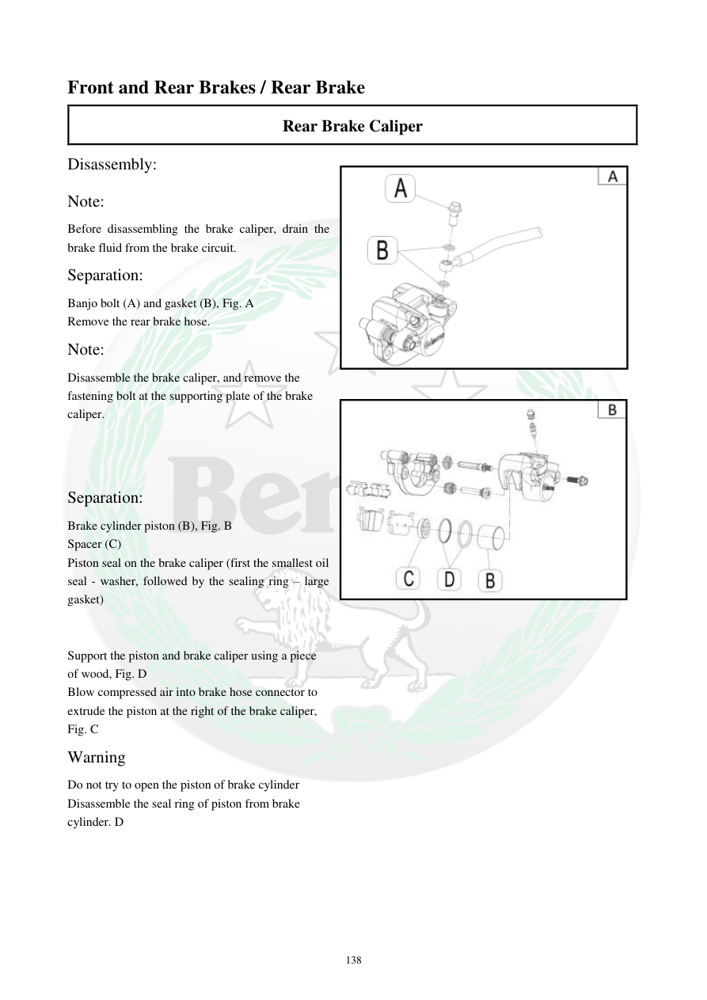

# Manual page 139

> Source: [page-0139.md](../source/page-0139.md)

## Page image / diagram

- [page-0139-img-01.png](../images/embedded/page-0139-img-01.png)

- [page-0139-img-02.jpeg](../images/embedded/page-0139-img-02.jpeg)

## Extracted text

# Source page 139

 
138 
Front and Rear Brakes / Rear Brake 
Rear Brake Caliper  
Disassembly: 
Note:  
Before disassembling the brake caliper, drain the 
brake fluid from the brake circuit.  
Separation:  
Banjo bolt (A) and gasket (B), Fig. A  
Remove the rear brake hose.  
Note:  
Disassemble the brake caliper, and remove the 
fastening bolt at the supporting plate of the brake 
caliper.  
 
 
 
Separation: 
Brake cylinder piston (B), Fig. B 
Spacer (C)  
Piston seal on the brake caliper (first the smallest oil 
seal - washer, followed by the sealing ring – large 
gasket) 
 
 
Support the piston and brake caliper using a piece  
of wood, Fig. D 
Blow compressed air into brake hose connector to  
extrude the piston at the right of the brake caliper,  
Fig. C  
Warning  
Do not try to open the piston of brake cylinder  
Disassemble the seal ring of piston from brake  
cylinder. D

## Persian notes

<!-- Persian translation/explanation will be added here. -->
