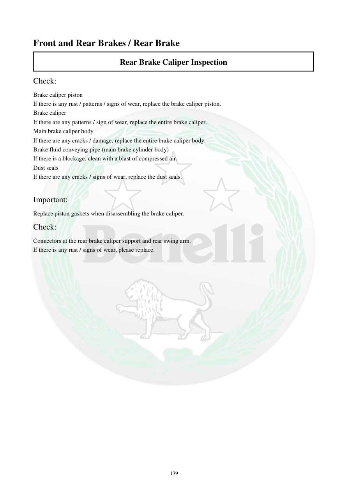

# Manual page 140

> Source: [page-0140.md](../source/page-0140.md)

## Page image / diagram

## Extracted text

# Source page 140

 
139 
Front and Rear Brakes / Rear Brake 
Rear Brake Caliper Inspection  
Check:  
Brake caliper piston 
If there is any rust / patterns / signs of wear, replace the brake caliper piston. 
Brake caliper 
If there are any patterns / sign of wear, replace the entire brake caliper. 
Main brake caliper body 
If there are any cracks / damage, replace the entire brake caliper body. 
Brake fluid conveying pipe (main brake cylinder body) 
If there is a blockage, clean with a blast of compressed air. 
Dust seals 
If there are any cracks / signs of wear, replace the dust seals. 
 
Important: 
Replace piston gaskets when disassembling the brake caliper.  
Check:  
Connectors at the rear brake caliper support and rear swing arm.  
If there is any rust / signs of wear, please replace.

## Persian notes

<!-- Persian translation/explanation will be added here. -->
