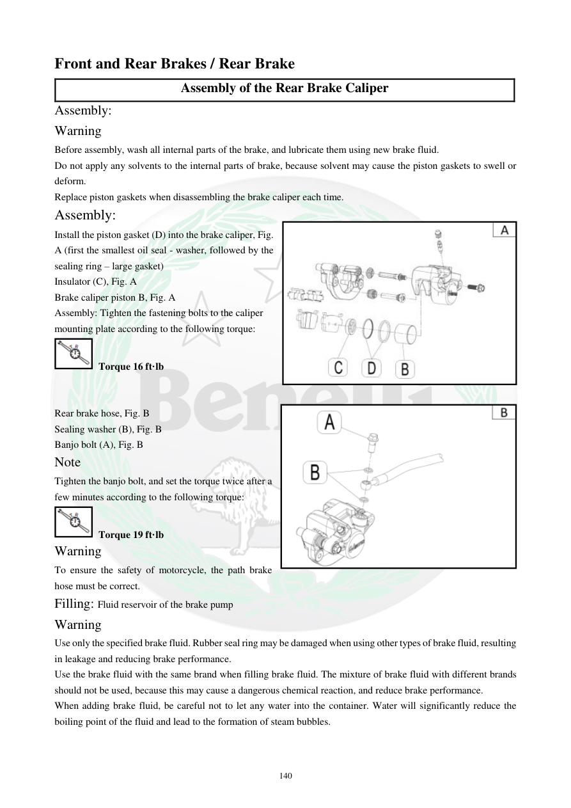

# Manual page 141

> Source: [page-0141.md](../source/page-0141.md)

## Page image / diagram

- [page-0141-img-02.jpeg](../images/embedded/page-0141-img-02.jpeg)

- [page-0141-img-03.png](../images/embedded/page-0141-img-03.png)

## Extracted text

# Source page 141

 
140 
Front and Rear Brakes / Rear Brake 
Assembly of the Rear Brake Caliper 
Assembly:  
Warning  
Before assembly, wash all internal parts of the brake, and lubricate them using new brake fluid.  
Do not apply any solvents to the internal parts of brake, because solvent may cause the piston gaskets to swell or 
deform.  
Replace piston gaskets when disassembling the brake caliper each time.  
Assembly:  
Install the piston gasket (D) into the brake caliper, Fig. 
A (first the smallest oil seal - washer, followed by the 
sealing ring – large gasket) 
Insulator (C), Fig. A 
Brake caliper piston B, Fig. A 
Assembly: Tighten the fastening bolts to the caliper 
mounting plate according to the following torque:  
 Torque 16 ft·lb 
 
 
Rear brake hose, Fig. B   
Sealing washer (B), Fig. B  
Banjo bolt (A), Fig. B  
Note  
Tighten the banjo bolt, and set the torque twice after a 
few minutes according to the following torque: 
 Torque 19 ft·lb 
Warning  
To ensure the safety of motorcycle, the path brake 
hose must be correct. 
Filling: Fluid reservoir of the brake pump  
Warning  
Use only the specified brake fluid. Rubber seal ring may be damaged when using other types of brake fluid, resulting 
in leakage and reducing brake performance.  
Use the brake fluid with the same brand when filling brake fluid. The mixture of brake fluid with different brands 
should not be used, because this may cause a dangerous chemical reaction, and reduce brake performance.  
When adding brake fluid, be careful not to let any water into the container. Water will significantly reduce the 
boiling point of the fluid and lead to the formation of steam bubbles.

## Persian notes

<!-- Persian translation/explanation will be added here. -->
