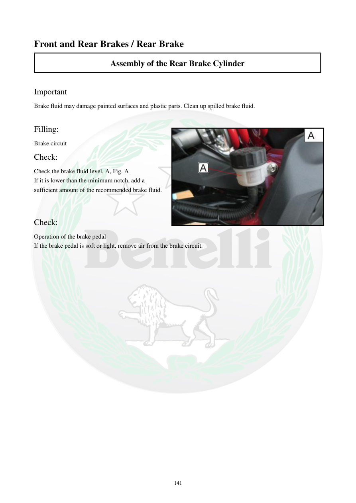

# Manual page 142

> Source: [page-0142.md](../source/page-0142.md)

## Page image / diagram

- [page-0142-img-01.jpeg](../images/embedded/page-0142-img-01.jpeg)

## Extracted text

# Source page 142

 
141 
Front and Rear Brakes / Rear Brake 
Assembly of the Rear Brake Cylinder  
 
Important  
Brake fluid may damage painted surfaces and plastic parts. Clean up spilled brake fluid.  
 
Filling:  
Brake circuit  
Check:  
Check the brake fluid level, A, Fig. A 
If it is lower than the minimum notch, add a 
sufficient amount of the recommended brake fluid.  
 
Check:  
Operation of the brake pedal 
If the brake pedal is soft or light, remove air from the brake circuit.

## Persian notes

### کنترل نهایی پمپ ترمز عقب
- روغن ترمز روی رنگ و قطعات پلاستیکی اثر مخرب دارد؛ هرگونه ریختگی را سریع تمیز کنید.
- سطح روغن ترمز را در نقطه **A** بررسی کنید.
- اگر پایین‌تر از علامت حداقل است، روغن ترمز توصیه‌شده اضافه کنید.
- عملکرد پدال ترمز را بررسی کنید.
- اگر پدال نرم یا سبک است، مدار را برای وجود هوا بررسی و هواگیری کنید.

