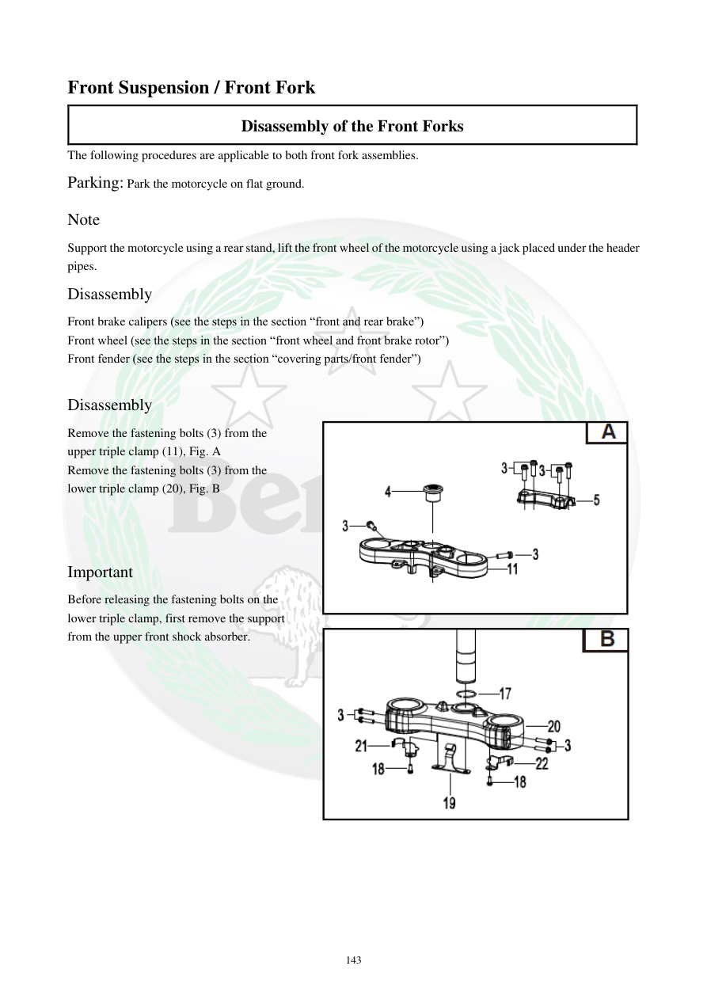

# Manual page 144

> Source: [page-0144.md](../source/page-0144.md)

## Page image / diagram

- [page-0144-img-01.png](../images/embedded/page-0144-img-01.png)

- [page-0144-img-02.png](../images/embedded/page-0144-img-02.png)

## Extracted text

# Source page 144

 
143 
Front Suspension / Front Fork  
Disassembly of the Front Forks 
The following procedures are applicable to both front fork assemblies.  
Parking: Park the motorcycle on flat ground. 
Note  
Support the motorcycle using a rear stand, lift the front wheel of the motorcycle using a jack placed under the header 
pipes. 
Disassembly 
Front brake calipers (see the steps in the section “front and rear brake”) 
Front wheel (see the steps in the section “front wheel and front brake rotor”) 
Front fender (see the steps in the section “covering parts/front fender”) 
 
Disassembly 
Remove the fastening bolts (3) from the 
upper triple clamp (11), Fig. A  
Remove the fastening bolts (3) from the 
lower triple clamp (20), Fig. B  
 
 
 
Important  
Before releasing the fastening bolts on the 
lower triple clamp, first remove the support 
from the upper front shock absorber.

## Persian notes

<!-- Persian translation/explanation will be added here. -->
