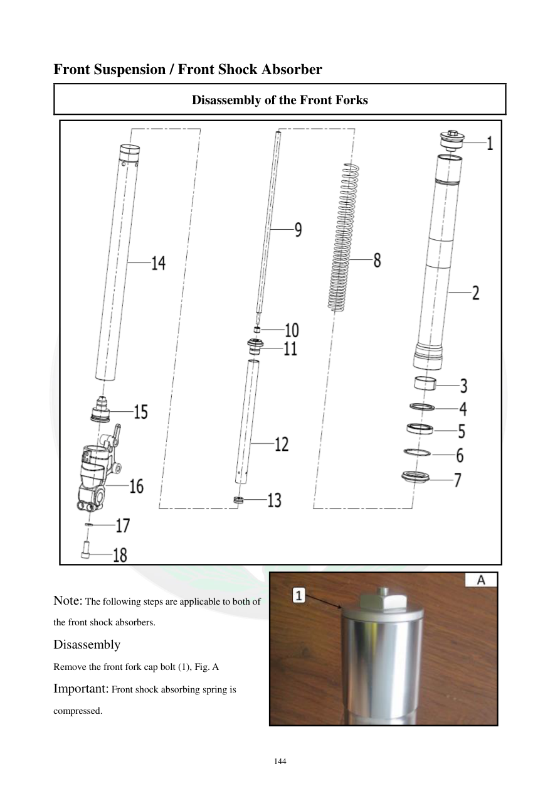

# Manual page 145

> Source: [page-0145.md](../source/page-0145.md)

## Page image / diagram

- [page-0145-img-01.jpeg](../images/embedded/page-0145-img-01.jpeg)

- [page-0145-img-03.png](../images/embedded/page-0145-img-03.png)

## Extracted text

# Source page 145

 
144 
Front Suspension / Front Shock Absorber  
Disassembly of the Front Forks  
 
 
Note: The following steps are applicable to both of 
the front shock absorbers.  
Disassembly 
Remove the front fork cap bolt (1), Fig. A  
Important: Front shock absorbing spring is 
compressed.

## Persian notes

<!-- Persian translation/explanation will be added here. -->
