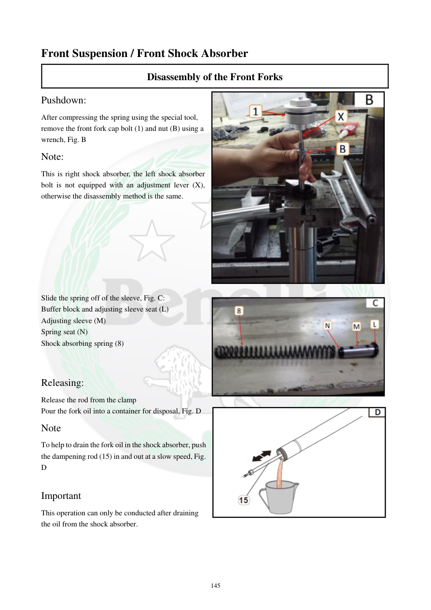

# Manual page 146

> Source: [page-0146.md](../source/page-0146.md)

## Page image / diagram

- [page-0146-img-01.jpeg](../images/embedded/page-0146-img-01.jpeg)

- [page-0146-img-02.jpeg](../images/embedded/page-0146-img-02.jpeg)

- [page-0146-img-03.png](../images/embedded/page-0146-img-03.png)

## Extracted text

# Source page 146

 
145 
Front Suspension / Front Shock Absorber 
Disassembly of the Front Forks  
Pushdown:  
After compressing the spring using the special tool, 
remove the front fork cap bolt (1) and nut (B) using a 
wrench, Fig. B  
Note:  
This is right shock absorber, the left shock absorber 
bolt is not equipped with an adjustment lever (X), 
otherwise the disassembly method is the same.  
 
 
 
 
 
 
 
 
Slide the spring off of the sleeve, Fig. C:  
Buffer block and adjusting sleeve seat (L)  
Adjusting sleeve (M) 
Spring seat (N) 
Shock absorbing spring (8) 
 
 
Releasing:  
Release the rod from the clamp  
Pour the fork oil into a container for disposal, Fig. D  
Note  
To help to drain the fork oil in the shock absorber, push 
the dampening rod (15) in and out at a slow speed, Fig. 
D  
  
Important  
This operation can only be conducted after draining 
the oil from the shock absorber.

## Persian notes

### تخلیه روغن دوشاخ جلو
- پس از فشرده‌کردن فنر با ابزار مخصوص، پیچ درپوش و مهره **B** را با آچار باز کنید.
- دوشاخ راست دارای اهرم تنظیم **X** است؛ دوشاخ چپ این اهرم را ندارد، اما روش بازکردن مشابه است.
- فنر، نشیمن فنر و قطعات تنظیم را از روی غلاف خارج کنید.
- میله را از کلمپ آزاد کنید.
- روغن دوشاخ را داخل ظرف مناسب تخلیه کنید.
- برای تخلیه بهتر، میله دمپینگ **15** را آرام و چند بار داخل و خارج کنید.
- این کار فقط **پس از تخلیه روغن** انجام شود.

