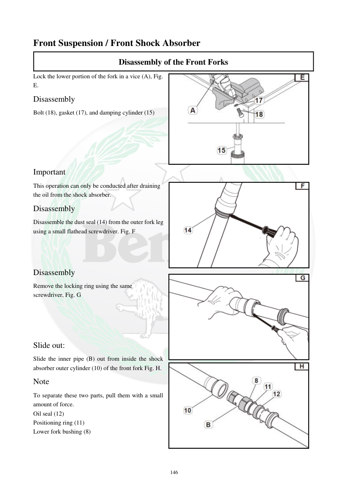

# Manual page 147

> Source: [page-0147.md](../source/page-0147.md)

## Page image / diagram

- [page-0147-img-01.png](../images/embedded/page-0147-img-01.png)

- [page-0147-img-02.png](../images/embedded/page-0147-img-02.png)

- [page-0147-img-03.jpeg](../images/embedded/page-0147-img-03.jpeg)

- [page-0147-img-04.jpeg](../images/embedded/page-0147-img-04.jpeg)

## Extracted text

# Source page 147

 
146 
Front Suspension / Front Shock Absorber 
Disassembly of the Front Forks 
Lock the lower portion of the fork in a vice (A), Fig. 
E.  
Disassembly 
Bolt (18), gasket (17), and damping cylinder (15)  
 
 
 
 
Important  
This operation can only be conducted after draining 
the oil from the shock absorber.  
Disassembly 
Disassemble the dust seal (14) from the outer fork leg 
using a small flathead screwdriver. Fig. F  
 
 
 
Disassembly 
Remove the locking ring using the same 
screwdriver, Fig. G 
 
 
 
 
Slide out:  
Slide the inner pipe (B) out from inside the shock 
absorber outer cylinder (10) of the front fork Fig. H. 
Note  
To separate these two parts, pull them with a small 
amount of force. 
Oil seal (12)  
Positioning ring (11)  
Lower fork bushing (8)

## Persian notes

### ادامه بازکردن دوشاخ جلو
- قسمت پایینی دوشاخ را طبق تصویر مهار کنید.
- پیچ 18، واشر 17 و میله دمپینگ 15 را باز کنید.
- این مرحله پس از تخلیه روغن دوشاخ انجام شود.
- کاسه‌نمد گردوغبار 14 و حلقه قفل را خارج کنید.
- لوله داخلی B را از سیلندر بیرونی دوشاخ خارج کنید.
- قطعات داخلی شامل کاسه‌نمد روغن 12، رینگ موقعیت‌دهنده 11 و بوش پایینی 8 هستند.
