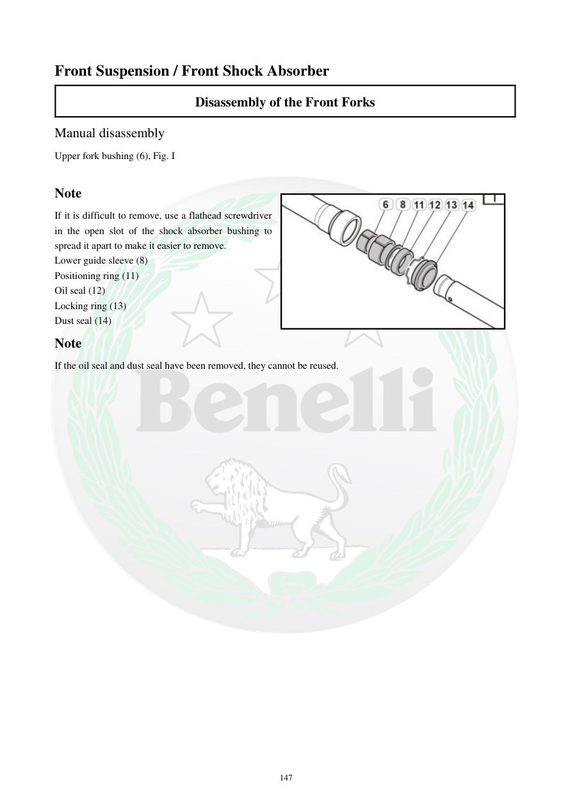

# Manual page 148

> Source: [page-0148.md](../source/page-0148.md)

## Page image / diagram

- [page-0148-img-01.jpeg](../images/embedded/page-0148-img-01.jpeg)

## Extracted text

# Source page 148

 
147 
Front Suspension / Front Shock Absorber 
Disassembly of the Front Forks  
Manual disassembly 
Upper fork bushing (6), Fig. I  
 
Note  
If it is difficult to remove, use a flathead screwdriver 
in the open slot of the shock absorber bushing to 
spread it apart to make it easier to remove.  
Lower guide sleeve (8)  
Positioning ring (11) 
Oil seal (12) 
Locking ring (13) 
Dust seal (14)  
Note  
If the oil seal and dust seal have been removed, they cannot be reused.

## Persian notes

<!-- Persian translation/explanation will be added here. -->
