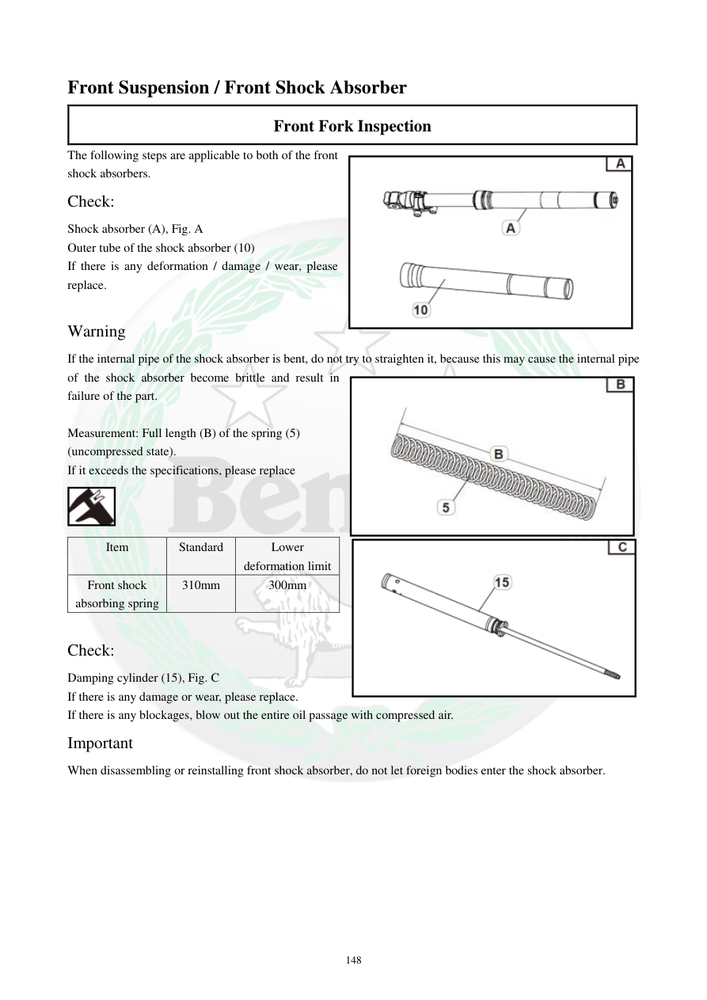

# Manual page 149

> Source: [page-0149.md](../source/page-0149.md)

## Page image / diagram

- [page-0149-img-01.png](../images/embedded/page-0149-img-01.png)

- [page-0149-img-02.jpeg](../images/embedded/page-0149-img-02.jpeg)

- [page-0149-img-03.png](../images/embedded/page-0149-img-03.png)

- [page-0149-img-04.png](../images/embedded/page-0149-img-04.png)

## Extracted text

# Source page 149

 
148 
Front Suspension / Front Shock Absorber 
Front Fork Inspection  
The following steps are applicable to both of the front 
shock absorbers. 
Check:  
Shock absorber (A), Fig. A 
Outer tube of the shock absorber (10) 
If there is any deformation / damage / wear, please 
replace.  
 
Warning  
If the internal pipe of the shock absorber is bent, do not try to straighten it, because this may cause the internal pipe 
of the shock absorber become brittle and result in 
failure of the part.  
 
Measurement: Full length (B) of the spring (5) 
(uncompressed state).  
If it exceeds the specifications, please replace  
 
Item  
Standard  
Lower 
deformation limit  
Front shock 
absorbing spring  
310mm 
300mm 
 
Check:  
Damping cylinder (15), Fig. C  
If there is any damage or wear, please replace.  
If there is any blockages, blow out the entire oil passage with compressed air.  
Important  
When disassembling or reinstalling front shock absorber, do not let foreign bodies enter the shock absorber.

## Persian notes

<!-- Persian translation/explanation will be added here. -->
