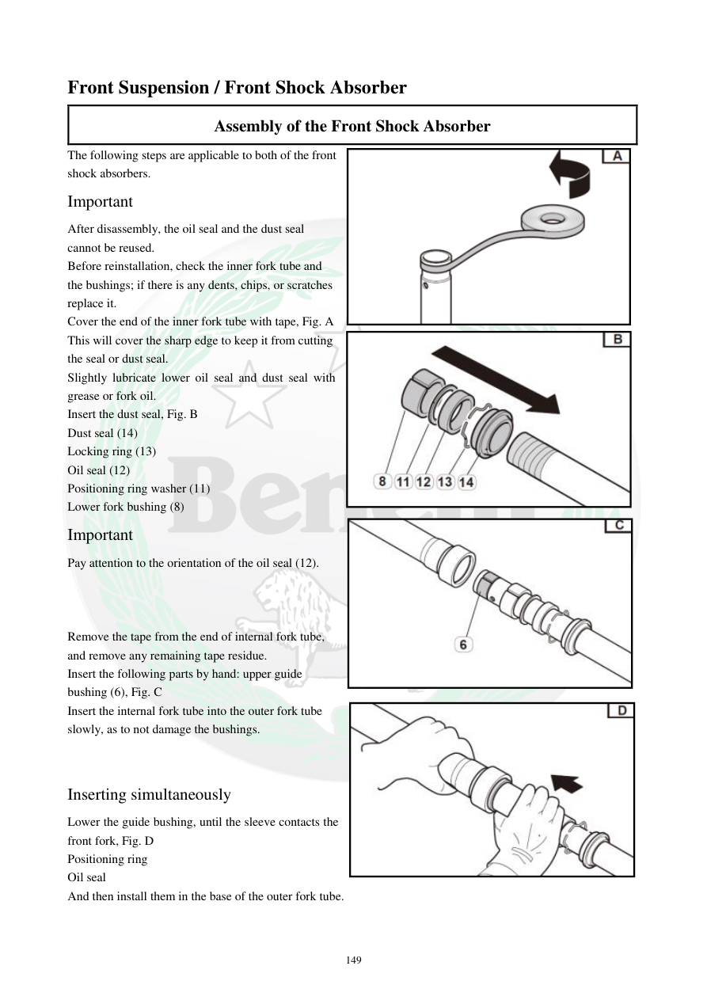

# Manual page 150

> Source: [page-0150.md](../source/page-0150.md)

## Page image / diagram

- [page-0150-img-01.png](../images/embedded/page-0150-img-01.png)

- [page-0150-img-02.jpeg](../images/embedded/page-0150-img-02.jpeg)

- [page-0150-img-03.jpeg](../images/embedded/page-0150-img-03.jpeg)

- [page-0150-img-04.jpeg](../images/embedded/page-0150-img-04.jpeg)

## Extracted text

# Source page 150

 
149 
Front Suspension / Front Shock Absorber 
Assembly of the Front Shock Absorber  
The following steps are applicable to both of the front 
shock absorbers. 
Important  
After disassembly, the oil seal and the dust seal 
cannot be reused.  
Before reinstallation, check the inner fork tube and 
the bushings; if there is any dents, chips, or scratches 
replace it.  
Cover the end of the inner fork tube with tape, Fig. A  
This will cover the sharp edge to keep it from cutting 
the seal or dust seal.  
Slightly lubricate lower oil seal and dust seal with 
grease or fork oil.  
Insert the dust seal, Fig. B 
Dust seal (14) 
Locking ring (13) 
Oil seal (12) 
Positioning ring washer (11) 
Lower fork bushing (8)  
Important  
Pay attention to the orientation of the oil seal (12).  
 
 
 
Remove the tape from the end of internal fork tube, 
and remove any remaining tape residue.  
Insert the following parts by hand: upper guide 
bushing (6), Fig. C  
Insert the internal fork tube into the outer fork tube 
slowly, as to not damage the bushings.  
 
 
Inserting simultaneously 
Lower the guide bushing, until the sleeve contacts the 
front fork, Fig. D  
Positioning ring  
Oil seal  
And then install them in the base of the outer fork tube.

## Persian notes

<!-- Persian translation/explanation will be added here. -->
