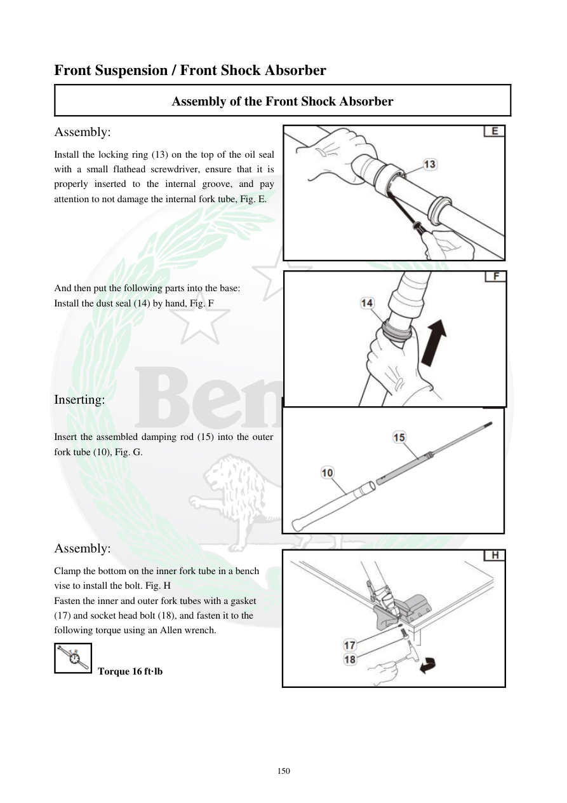

# Manual page 151

> Source: [page-0151.md](../source/page-0151.md)

## Page image / diagram

- [page-0151-img-02.jpeg](../images/embedded/page-0151-img-02.jpeg)

- [page-0151-img-03.png](../images/embedded/page-0151-img-03.png)

- [page-0151-img-04.jpeg](../images/embedded/page-0151-img-04.jpeg)

- [page-0151-img-05.jpeg](../images/embedded/page-0151-img-05.jpeg)

## Extracted text

# Source page 151

 
150 
Front Suspension / Front Shock Absorber 
Assembly of the Front Shock Absorber  
Assembly:  
Install the locking ring (13) on the top of the oil seal 
with a small flathead screwdriver, ensure that it is 
properly inserted to the internal groove, and pay 
attention to not damage the internal fork tube, Fig. E.  
 
 
 
 
 
And then put the following parts into the base:  
Install the dust seal (14) by hand, Fig. F  
 
 
 
 
 
Inserting:  
 
Insert the assembled damping rod (15) into the outer 
fork tube (10), Fig. G.  
 
 
 
 
 
Assembly:  
Clamp the bottom on the inner fork tube in a bench 
vise to install the bolt. Fig. H  
Fasten the inner and outer fork tubes with a gasket 
(17) and socket head bolt (18), and fasten it to the 
following torque using an Allen wrench.  
 Torque 16 ft·lb

## Persian notes

### ادامه مونتاژ دوشاخ جلو
- حلقه قفل **13** را بالای کاسه‌نمد روغن نصب کنید و مطمئن شوید کاملاً داخل شیار داخلی قرار گرفته است.
- هنگام جاگذاری حلقه قفل، به سطح لوله داخلی آسیب نزنید.
- کاسه‌نمد گردوغبار **14** را با دست نصب کنید.
- میله دمپینگ **15** را داخل لوله بیرونی قرار دهید.
- برای بستن پیچ پایینی، قسمت پایین لوله داخلی را در گیره کارگاهی مهار کنید.
- پیچ آلن **18** همراه واشر **17** را با گشتاور **16 ft·lb** ببندید.

