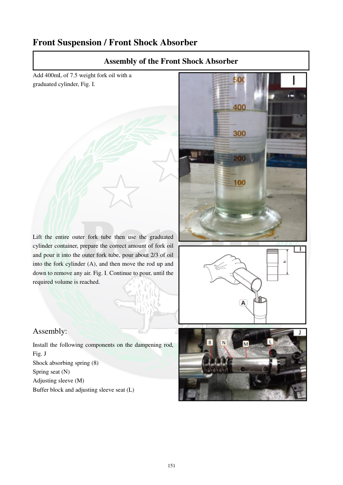

# Manual page 152

> Source: [page-0152.md](../source/page-0152.md)

## Page image / diagram

- [page-0152-img-01.jpeg](../images/embedded/page-0152-img-01.jpeg)

- [page-0152-img-02.jpeg](../images/embedded/page-0152-img-02.jpeg)

- [page-0152-img-03.png](../images/embedded/page-0152-img-03.png)

## Extracted text

# Source page 152

 
151 
Front Suspension / Front Shock Absorber 
Assembly of the Front Shock Absorber  
Add 400mL of 7.5 weight fork oil with a 
graduated cylinder, Fig. I.  
 
 
 
 
 
 
 
 
 
 
 
 
 
 
 
 
Lift the entire outer fork tube then use the graduated 
cylinder container, prepare the correct amount of fork oil 
and pour it into the outer fork tube, pour about 2/3 of oil 
into the fork cylinder (A), and then move the rod up and 
down to remove any air. Fig. I. Continue to pour, until the 
required volume is reached.  
 
 
 
 
Assembly:  
Install the following components on the dampening rod, 
Fig. J 
Shock absorbing spring (8) 
Spring seat (N)  
Adjusting sleeve (M)  
Buffer block and adjusting sleeve seat (L)

## Persian notes

<!-- Persian translation/explanation will be added here. -->
