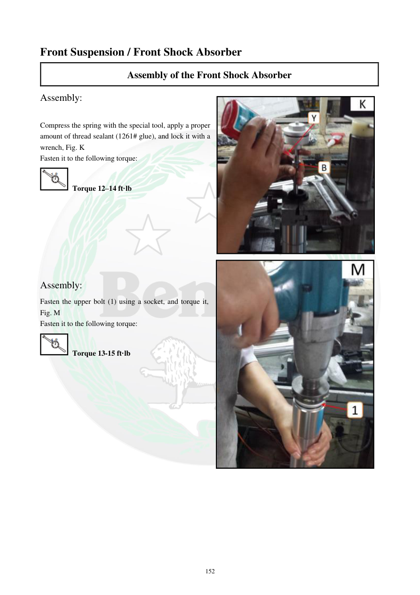

# Manual page 153

> Source: [page-0153.md](../source/page-0153.md)

## Page image / diagram

- [page-0153-img-02.png](../images/embedded/page-0153-img-02.png)

- [page-0153-img-03.jpeg](../images/embedded/page-0153-img-03.jpeg)

- [page-0153-img-04.jpeg](../images/embedded/page-0153-img-04.jpeg)

## Extracted text

# Source page 153

 
152 
Front Suspension / Front Shock Absorber 
Assembly of the Front Shock Absorber 
Assembly:  
 
Compress the spring with the special tool, apply a proper 
amount of thread sealant (1261# glue), and lock it with a 
wrench, Fig. K 
Fasten it to the following torque:  
 Torque 12–14 ft·lb 
 
 
 
 
 
 
 
Assembly:  
Fasten the upper bolt (1) using a socket, and torque it, 
Fig. M  
Fasten it to the following torque:  
 Torque 13-15 ft·lb

## Persian notes

<!-- Persian translation/explanation will be added here. -->
