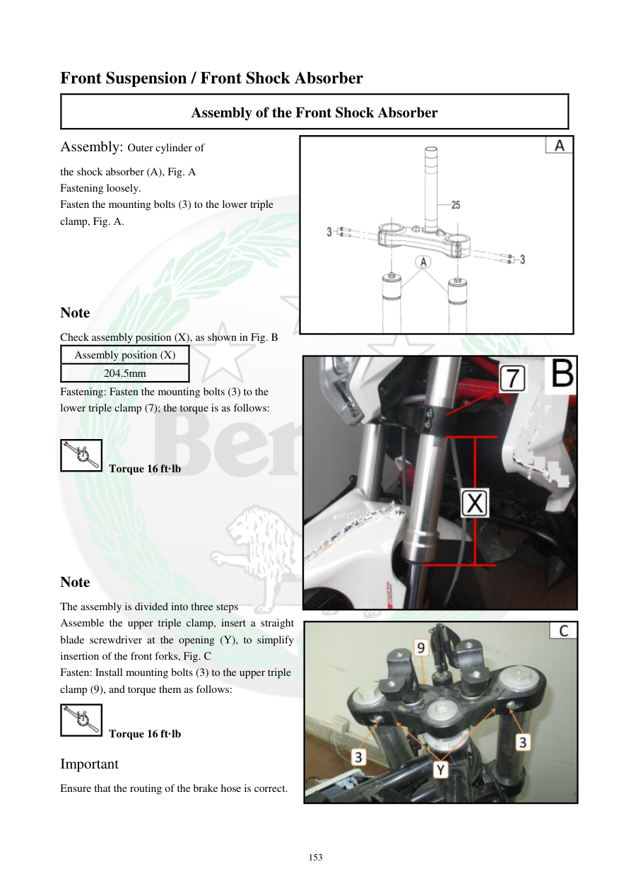

# Manual page 154

> Source: [page-0154.md](../source/page-0154.md)

## Page image / diagram

- [page-0154-img-02.png](../images/embedded/page-0154-img-02.png)

- [page-0154-img-03.jpeg](../images/embedded/page-0154-img-03.jpeg)

- [page-0154-img-04.jpeg](../images/embedded/page-0154-img-04.jpeg)

## Extracted text

# Source page 154

 
153 
Front Suspension / Front Shock Absorber 
Assembly of the Front Shock Absorber 
Assembly: Outer cylinder of 
the shock absorber (A), Fig. A 
Fastening loosely.  
Fasten the mounting bolts (3) to the lower triple 
clamp, Fig. A.  
 
 
 
 
Note  
Check assembly position (X), as shown in Fig. B  
Assembly position (X) 
204.5mm 
Fastening: Fasten the mounting bolts (3) to the 
lower triple clamp (7); the torque is as follows:  
 
 Torque 16 ft·lb 
 
 
 
 
 
Note  
The assembly is divided into three steps  
Assemble the upper triple clamp, insert a straight 
blade screwdriver at the opening (Y), to simplify 
insertion of the front forks, Fig. C  
Fasten: Install mounting bolts (3) to the upper triple 
clamp (9), and torque them as follows:  
 Torque 16 ft·lb 
Important  
Ensure that the routing of the brake hose is correct.

## Persian notes

<!-- Persian translation/explanation will be added here. -->
