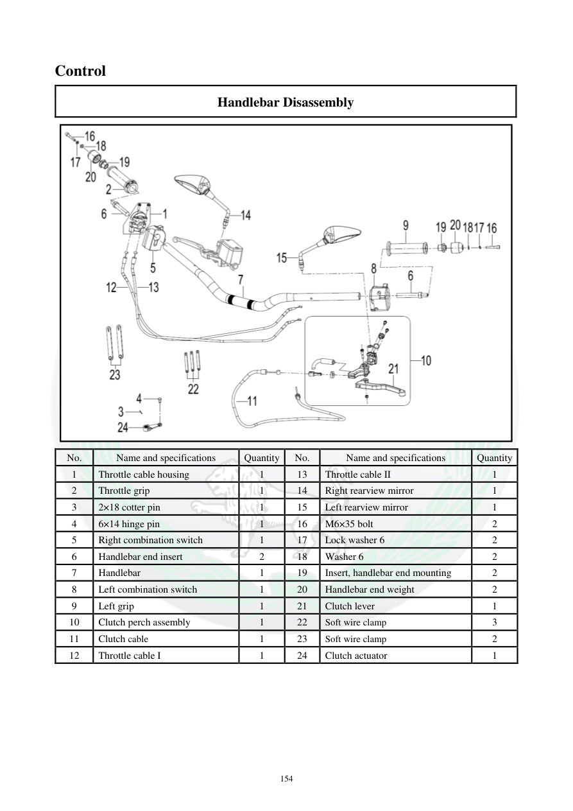

# Manual page 155

> Source: [page-0155.md](../source/page-0155.md)

## Page image / diagram

- [page-0155-img-02.png](../images/embedded/page-0155-img-02.png)

## Extracted text

# Source page 155

 
154 
Control  
Handlebar Disassembly 
 
No. 
Name and specifications  
Quantity 
No. 
Name and specifications 
Quantity 
1 
Throttle cable housing 
1 
13 
Throttle cable II 
1 
2 
Throttle grip 
1 
14 
Right rearview mirror  
1 
3 
2×18 cotter pin 
1 
15 
Left rearview mirror  
1 
4 
6×14 hinge pin  
1 
16 
M6×35 bolt 
2 
5 
Right combination switch 
1 
17 
Lock washer 6 
2 
6 
Handlebar end insert 
2 
18 
Washer 6 
2 
7 
Handlebar 
1 
19 
Insert, handlebar end mounting 
2 
8 
Left combination switch 
1 
20 
Handlebar end weight 
2 
9 
Left grip 
1 
21 
Clutch lever 
1 
10 
Clutch perch assembly 
1 
22 
Soft wire clamp 
3 
11 
Clutch cable  
1 
23 
Soft wire clamp 
2 
12 
Throttle cable I 
1 
24 
Clutch actuator 
1

## Persian notes

<!-- Persian translation/explanation will be added here. -->
