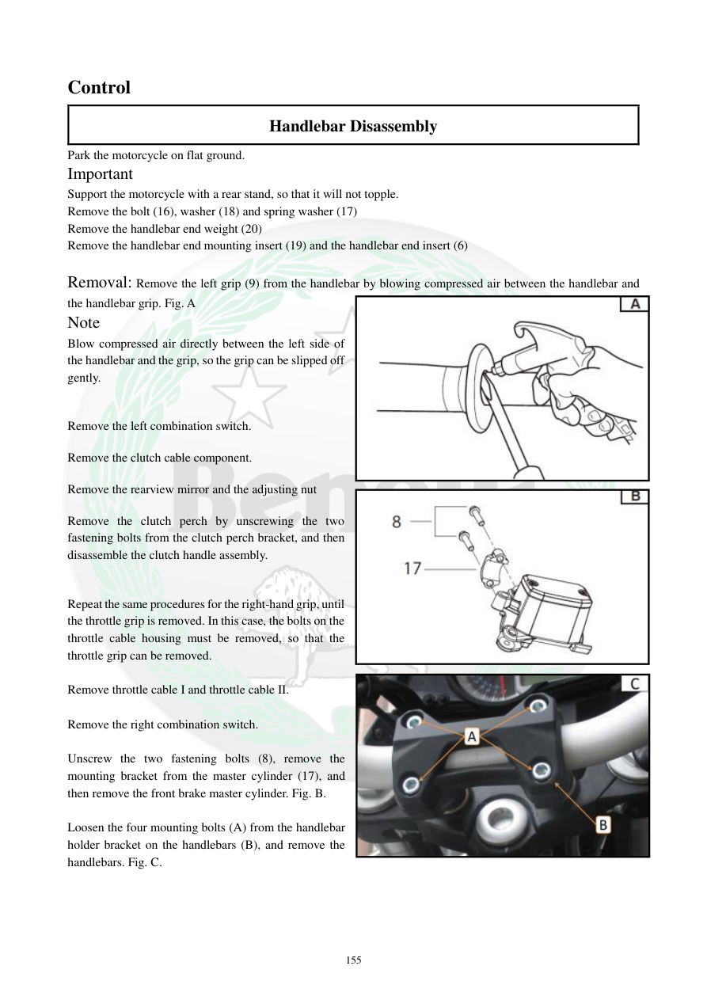

# Manual page 156

> Source: [page-0156.md](../source/page-0156.md)

## Page image / diagram

- [page-0156-img-01.jpeg](../images/embedded/page-0156-img-01.jpeg)

- [page-0156-img-02.jpeg](../images/embedded/page-0156-img-02.jpeg)

- [page-0156-img-03.jpeg](../images/embedded/page-0156-img-03.jpeg)

## Extracted text

# Source page 156

 
155 
Control 
Handlebar Disassembly 
Park the motorcycle on flat ground. 
Important  
Support the motorcycle with a rear stand, so that it will not topple. 
Remove the bolt (16), washer (18) and spring washer (17) 
Remove the handlebar end weight (20) 
Remove the handlebar end mounting insert (19) and the handlebar end insert (6) 
 
Removal: Remove the left grip (9) from the handlebar by blowing compressed air between the handlebar and 
the handlebar grip. Fig. A 
Note 
Blow compressed air directly between the left side of 
the handlebar and the grip, so the grip can be slipped off 
gently. 
 
Remove the left combination switch. 
Remove the clutch cable component. 
Remove the rearview mirror and the adjusting nut 
Remove the clutch perch by unscrewing the two 
fastening bolts from the clutch perch bracket, and then 
disassemble the clutch handle assembly. 
 
Repeat the same procedures for the right-hand grip, until 
the throttle grip is removed. In this case, the bolts on the 
throttle cable housing must be removed, so that the 
throttle grip can be removed. 
 
Remove throttle cable I and throttle cable II. 
 
Remove the right combination switch. 
 
Unscrew the two fastening bolts (8), remove the 
mounting bracket from the master cylinder (17), and 
then remove the front brake master cylinder. Fig. B. 
 
Loosen the four mounting bolts (A) from the handlebar 
holder bracket on the handlebars (B), and remove the 
handlebars. Fig. C.

## Persian notes

### بازکردن فرمان
- موتور روی سطح صاف و با پایه عقب مهار شود تا واژگون نشود.
- وزنه انتهایی فرمان و قطعات نگهدارنده آن را باز کنید.
- برای خارج‌کردن گریپ چپ، هوای فشرده را بین گریپ و فرمان وارد کنید تا گریپ بدون آسیب جدا شود.
- کلید چپ، مجموعه کابل کلاچ، آینه و پایه کلاچ را باز کنید.
- در سمت راست، پیچ‌های پوسته کابل گاز را باز کرده و گریپ گاز را خارج کنید؛ سپس دو کابل گاز و کلید راست را جدا کنید.
- پایه پمپ ترمز جلو را باز کرده و پمپ را جدا کنید.
- چهار پیچ نگهدارنده پایه فرمان را شل کرده و خود فرمان را خارج کنید.

