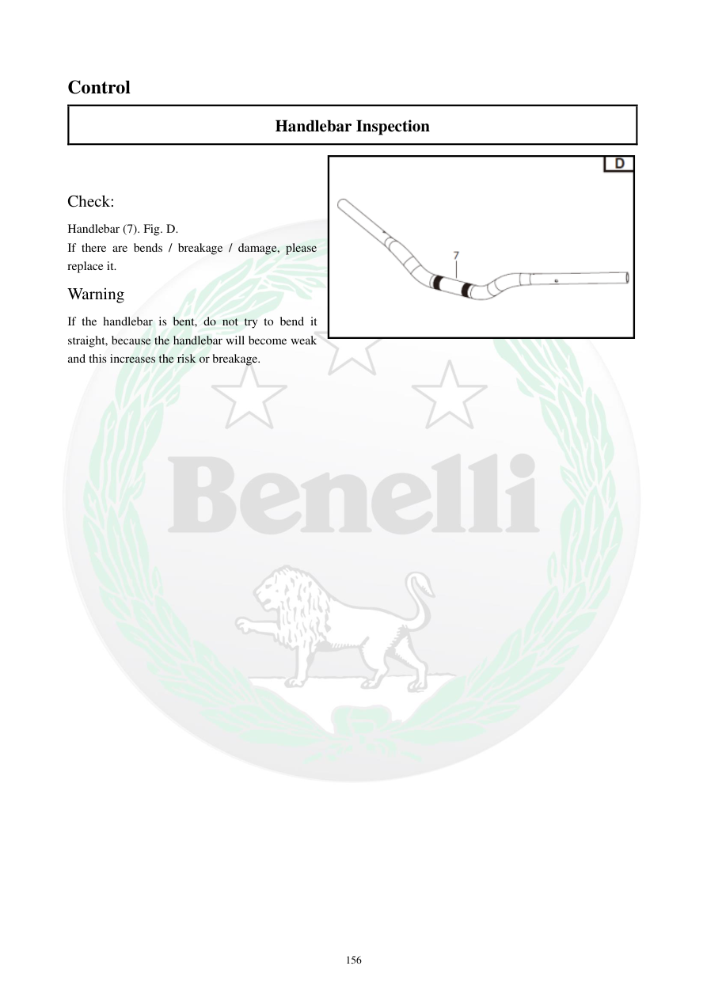

# Manual page 157

> Source: [page-0157.md](../source/page-0157.md)

## Page image / diagram

- [page-0157-img-01.png](../images/embedded/page-0157-img-01.png)

## Extracted text

# Source page 157

 
156 
Control  
Handlebar Inspection  
 
Check: 
Handlebar (7). Fig. D. 
If there are bends / breakage / damage, please 
replace it. 
Warning 
If the handlebar is bent, do not try to bend it 
straight, because the handlebar will become weak 
and this increases the risk or breakage.

## Persian notes

<!-- Persian translation/explanation will be added here. -->
