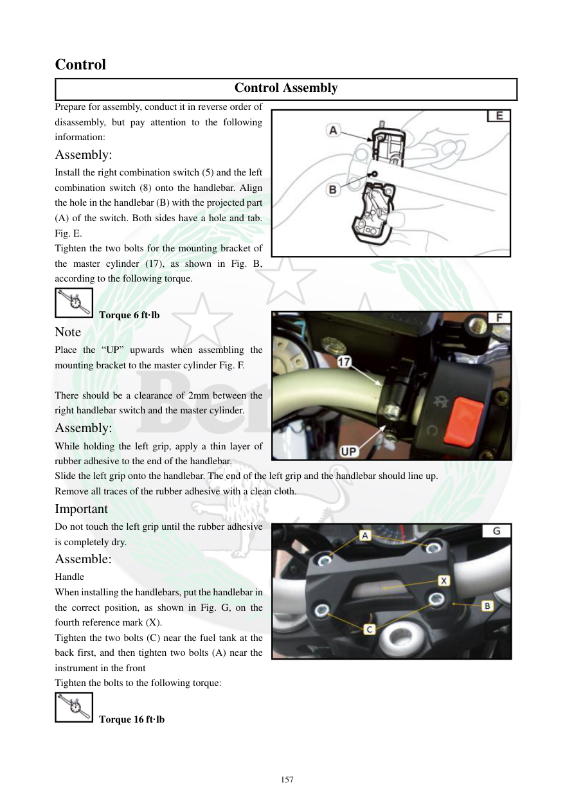

# Manual page 158

> Source: [page-0158.md](../source/page-0158.md)

## Page image / diagram

- [page-0158-img-02.jpeg](../images/embedded/page-0158-img-02.jpeg)

- [page-0158-img-03.jpeg](../images/embedded/page-0158-img-03.jpeg)

- [page-0158-img-04.jpeg](../images/embedded/page-0158-img-04.jpeg)

## Extracted text

# Source page 158

 
157 
Control  
Control Assembly 
Prepare for assembly, conduct it in reverse order of 
disassembly, but pay attention to the following 
information: 
Assembly: 
Install the right combination switch (5) and the left 
combination switch (8) onto the handlebar. Align 
the hole in the handlebar (B) with the projected part 
(A) of the switch. Both sides have a hole and tab. 
Fig. E. 
Tighten the two bolts for the mounting bracket of 
the master cylinder (17), as shown in Fig. B, 
according to the following torque. 
 Torque 6 ft·lb 
Note 
Place the “UP” upwards when assembling the 
mounting bracket to the master cylinder Fig. F.  
 
There should be a clearance of 2mm between the 
right handlebar switch and the master cylinder. 
Assembly: 
While holding the left grip, apply a thin layer of 
rubber adhesive to the end of the handlebar. 
Slide the left grip onto the handlebar. The end of the left grip and the handlebar should line up. 
Remove all traces of the rubber adhesive with a clean cloth. 
Important 
Do not touch the left grip until the rubber adhesive 
is completely dry. 
Assemble: 
Handle 
When installing the handlebars, put the handlebar in 
the correct position, as shown in Fig. G, on the 
fourth reference mark (X). 
Tighten the two bolts (C) near the fuel tank at the 
back first, and then tighten two bolts (A) near the 
instrument in the front 
Tighten the bolts to the following torque:  
 Torque 16 ft·lb

## Persian notes

<!-- Persian translation/explanation will be added here. -->
