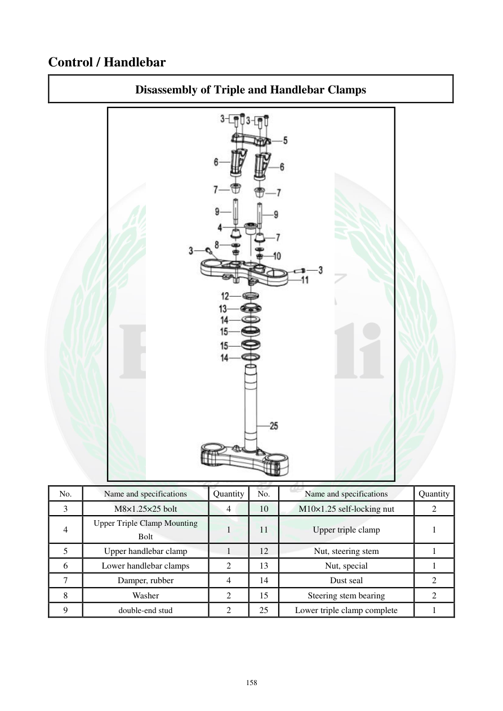

# Manual page 159

> Source: [page-0159.md](../source/page-0159.md)

## Page image / diagram

- [page-0159-img-01.jpeg](../images/embedded/page-0159-img-01.jpeg)

## Extracted text

# Source page 159

 
158 
Control / Handlebar 
Disassembly of Triple and Handlebar Clamps  
 
No. 
Name and specifications 
Quantity 
No. 
Name and specifications 
Quantity 
3 
M8×1.25×25 bolt  
4 
10 
M10×1.25 self-locking nut 
2 
4 
Upper Triple Clamp Mounting 
Bolt 
1 
11 
Upper triple clamp 
1 
5 
Upper handlebar clamp 
1 
12 
Nut, steering stem 
1 
6 
Lower handlebar clamps  
2 
13 
Nut, special 
1 
7 
Damper, rubber 
4 
14 
Dust seal 
2 
8 
Washer 
2 
15 
Steering stem bearing 
2 
9 
double-end stud 
2 
25 
Lower triple clamp complete 
1

## Persian notes

<!-- Persian translation/explanation will be added here. -->
