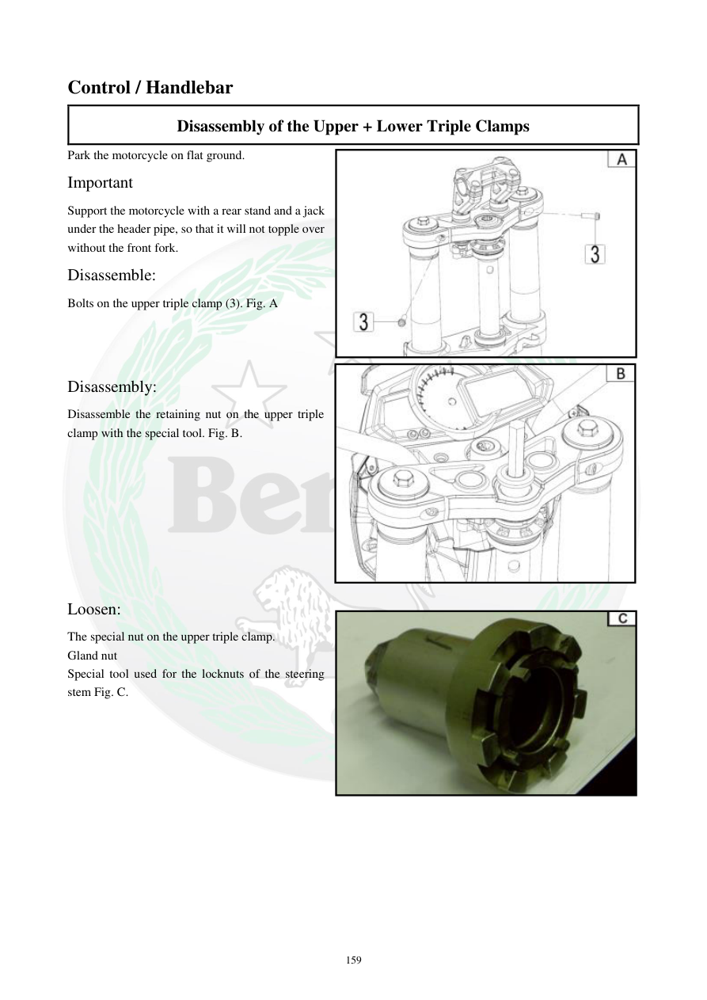

# Manual page 160

> Source: [page-0160.md](../source/page-0160.md)

## Page image / diagram

- [page-0160-img-01.jpeg](../images/embedded/page-0160-img-01.jpeg)

- [page-0160-img-02.jpeg](../images/embedded/page-0160-img-02.jpeg)

- [page-0160-img-03.jpeg](../images/embedded/page-0160-img-03.jpeg)

## Extracted text

# Source page 160

 
159 
Control / Handlebar 
Disassembly of the Upper + Lower Triple Clamps 
Park the motorcycle on flat ground. 
Important 
Support the motorcycle with a rear stand and a jack 
under the header pipe, so that it will not topple over 
without the front fork. 
Disassemble: 
Bolts on the upper triple clamp (3). Fig. A 
 
 
 
Disassembly: 
Disassemble the retaining nut on the upper triple 
clamp with the special tool. Fig. B. 
 
 
 
 
 
 
 
 
Loosen: 
The special nut on the upper triple clamp. 
Gland nut 
Special tool used for the locknuts of the steering 
stem Fig. C.

## Persian notes

<!-- Persian translation/explanation will be added here. -->
