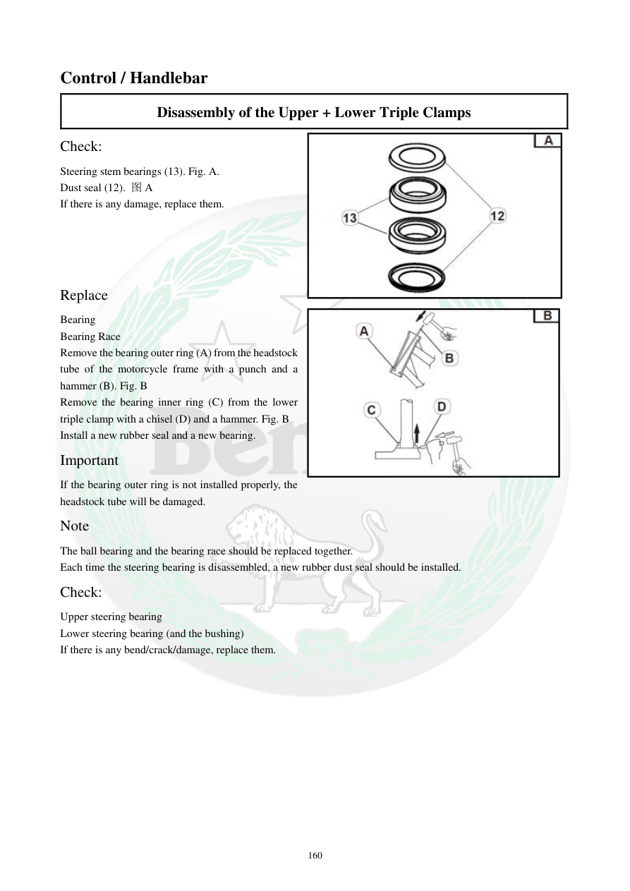

# Manual page 161

> Source: [page-0161.md](../source/page-0161.md)

## Page image / diagram

- [page-0161-img-01.jpeg](../images/embedded/page-0161-img-01.jpeg)

- [page-0161-img-02.jpeg](../images/embedded/page-0161-img-02.jpeg)

## Extracted text

# Source page 161

 
160 
Control / Handlebar 
Disassembly of the Upper + Lower Triple Clamps 
Check: 
Steering stem bearings (13). Fig. A. 
Dust seal (12). 图A 
If there is any damage, replace them. 
 
 
 
 
Replace 
Bearing 
Bearing Race 
Remove the bearing outer ring (A) from the headstock 
tube of the motorcycle frame with a punch and a 
hammer (B). Fig. B 
Remove the bearing inner ring (C) from the lower 
triple clamp with a chisel (D) and a hammer. Fig. B 
Install a new rubber seal and a new bearing. 
Important 
If the bearing outer ring is not installed properly, the 
headstock tube will be damaged. 
Note 
The ball bearing and the bearing race should be replaced together. 
Each time the steering bearing is disassembled, a new rubber dust seal should be installed. 
Check:  
Upper steering bearing 
Lower steering bearing (and the bushing) 
If there is any bend/crack/damage, replace them.

## Persian notes

### بازرسی و تعویض بلبرینگ فرمان
- بلبرینگ‌های محور فرمان و کاسه‌نمد گردوغبار را بررسی و در صورت آسیب تعویض کنید.
- رینگ بیرونی بلبرینگ از لوله سرشاسی با سنبه و چکش خارج می‌شود و رینگ داخلی از سه‌راهی پایین جدا می‌شود.
- نصب صحیح رینگ بیرونی مهم است، چون نصب نادرست می‌تواند به لوله سرشاسی آسیب بزند.
- بلبرینگ و رینگ آن باید **با هم** تعویض شوند.
- هر بار بازشدن بلبرینگ فرمان، کاسه‌نمد گردوغبار نو نصب شود.
- سه‌راهی و بوش را از نظر خم‌شدگی، ترک و آسیب بررسی کنید.
