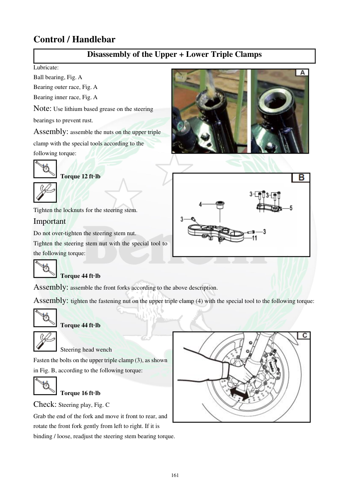

# Manual page 162

> Source: [page-0162.md](../source/page-0162.md)

## Page image / diagram

- [page-0162-img-03.jpeg](../images/embedded/page-0162-img-03.jpeg)

- [page-0162-img-04.png](../images/embedded/page-0162-img-04.png)

- [page-0162-img-05.jpeg](../images/embedded/page-0162-img-05.jpeg)

## Extracted text

# Source page 162

 
161 
Control / Handlebar 
Disassembly of the Upper + Lower Triple Clamps 
Lubricate: 
Ball bearing, Fig. A 
Bearing outer race, Fig. A 
Bearing inner race, Fig. A 
Note: Use lithium based grease on the steering 
bearings to prevent rust. 
Assembly: assemble the nuts on the upper triple 
clamp with the special tools according to the 
following torque: 
 Torque 12 ft·lb  
 
Tighten the locknuts for the steering stem. 
Important 
Do not over-tighten the steering stem nut. 
Tighten the steering stem nut with the special tool to 
the following torque: 
 Torque 44 ft·lb 
Assembly: assemble the front forks according to the above description. 
Assembly: tighten the fastening nut on the upper triple clamp (4) with the special tool to the following torque: 
 Torque 44 ft·lb 
 Steering head wench 
Fasten the bolts on the upper triple clamp (3), as shown 
in Fig. B, according to the following torque: 
 Torque 16 ft·lb 
Check: Steering play, Fig. C 
Grab the end of the fork and move it front to rear, and 
rotate the front fork gently from left to right. If it is  
binding / loose, readjust the steering stem bearing torque.

## Persian notes

### مونتاژ و تنظیم فرمان
- بلبرینگ و رینگ‌های فرمان را با گریس پایه لیتیم روان‌کاری کنید.
- گشتاور مهره‌های سه‌راهی بالا: **12 ft·lb**.
- مهره محور فرمان را بیش از حد سفت نکنید؛ گشتاور آن **44 ft·lb** است.
- مهره اتصال سه‌راهی بالایی **4**: **44 ft·lb**.
- پیچ‌های سه‌راهی بالا **3**: **16 ft·lb**.
- پس از مونتاژ، بازی فرمان را با حرکت دادن دوشاخ از جلو به عقب و چرخاندن آرام چپ و راست بررسی کنید. گیرکردن یا لقی یعنی تنظیم بلبرینگ فرمان باید دوباره بررسی شود.
