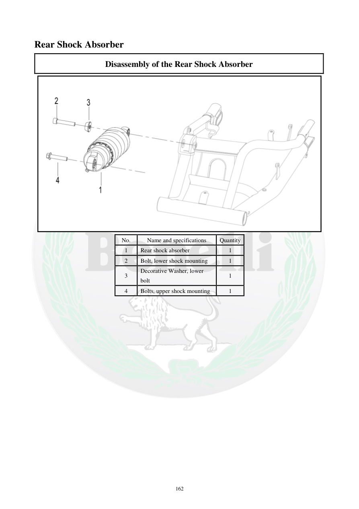

# Manual page 163

> Source: [page-0163.md](../source/page-0163.md)

## Page image / diagram

- [page-0163-img-02.png](../images/embedded/page-0163-img-02.png)

## Extracted text

# Source page 163

 
162 
Rear Shock Absorber 
Disassembly of the Rear Shock Absorber  
 
No. 
Name and specifications 
Quantity 
1 
Rear shock absorber  
1 
2 
Bolt, lower shock mounting 
1 
3 
Decorative Washer, lower 
bolt 
1 
4 
Bolts, upper shock mounting 
1

## Persian notes

### اجزای کمک عقب
فهرست صفحه شامل کمک عقب، پیچ اتصال پایینی، واشر تزئینی و پیچ اتصال بالایی است. تصویر صفحه مرجع شناسایی دقیق قطعات و محل نصب است.
