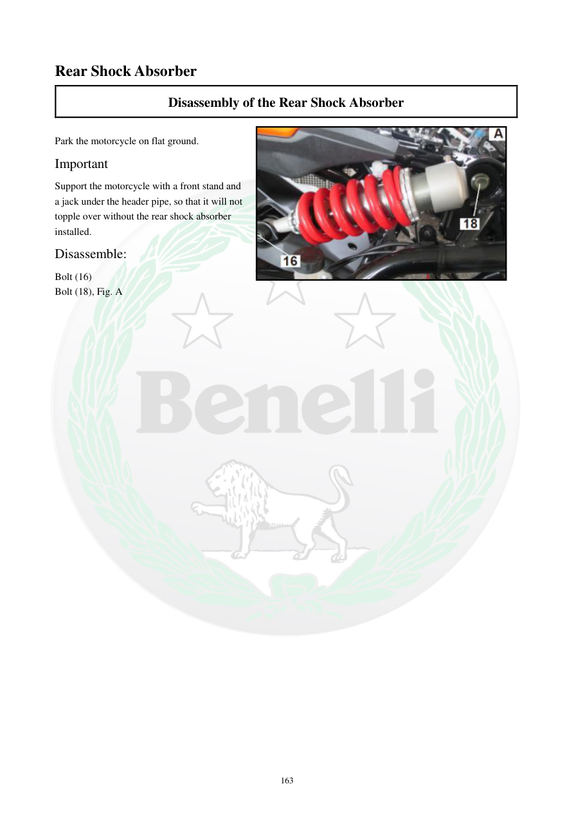

# Manual page 164

> Source: [page-0164.md](../source/page-0164.md)

## Page image / diagram

- [page-0164-img-01.jpeg](../images/embedded/page-0164-img-01.jpeg)

## Extracted text

# Source page 164

 
163 
Rear Shock Absorber 
Disassembly of the Rear Shock Absorber 
 
Park the motorcycle on flat ground. 
Important 
Support the motorcycle with a front stand and 
a jack under the header pipe, so that it will not 
topple over without the rear shock absorber 
installed. 
Disassemble: 
Bolt (16) 
Bolt (18), Fig. A

## Persian notes

<!-- Persian translation/explanation will be added here. -->
