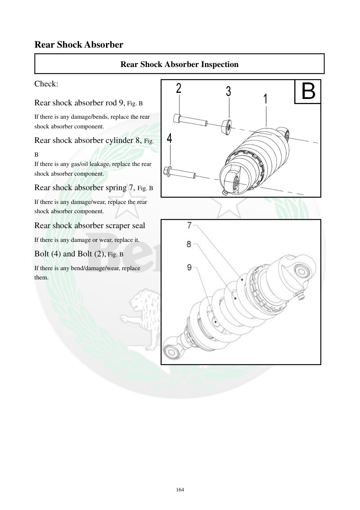

# Manual page 165

> Source: [page-0165.md](../source/page-0165.md)

## Page image / diagram

- [page-0165-img-01.png](../images/embedded/page-0165-img-01.png)

- [page-0165-img-02.jpeg](../images/embedded/page-0165-img-02.jpeg)

## Extracted text

# Source page 165

 
164 
Rear Shock Absorber 
Rear Shock Absorber Inspection 
Check: 
Rear shock absorber rod 9, Fig. B 
If there is any damage/bends, replace the rear 
shock absorber component. 
Rear shock absorber cylinder 8, Fig. 
B 
If there is any gas/oil leakage, replace the rear 
shock absorber component. 
Rear shock absorber spring 7, Fig. B 
If there is any damage/wear, replace the rear 
shock absorber component. 
Rear shock absorber scraper seal 
If there is any damage or wear, replace it. 
Bolt (4) and Bolt (2), Fig. B 
If there is any bend/damage/wear, replace 
them.

## Persian notes

<!-- Persian translation/explanation will be added here. -->
