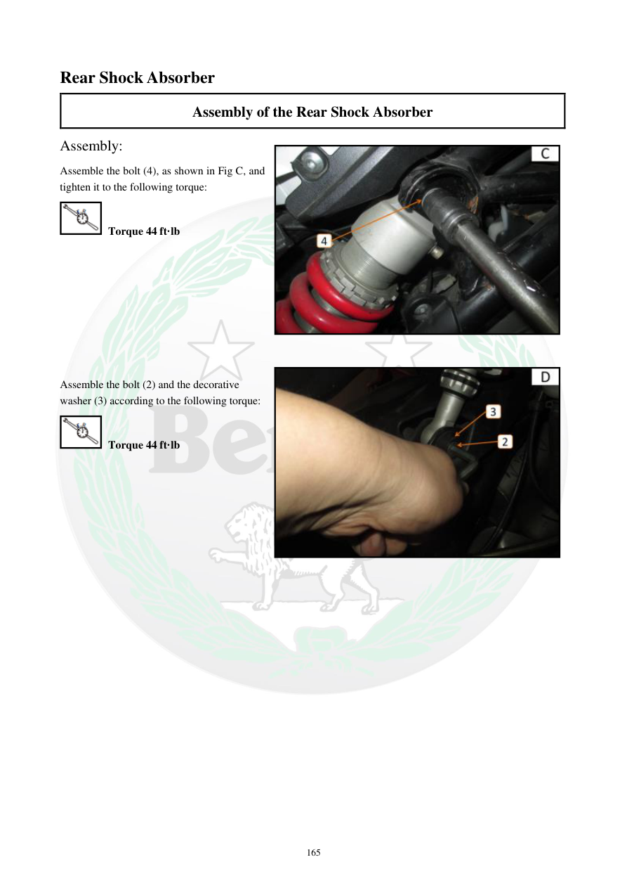

# Manual page 166

> Source: [page-0166.md](../source/page-0166.md)

## Page image / diagram

- [page-0166-img-02.jpeg](../images/embedded/page-0166-img-02.jpeg)

- [page-0166-img-03.jpeg](../images/embedded/page-0166-img-03.jpeg)

## Extracted text

# Source page 166

 
165 
Rear Shock Absorber 
Assembly of the Rear Shock Absorber 
Assembly: 
Assemble the bolt (4), as shown in Fig C, and 
tighten it to the following torque: 
 Torque 44 ft·lb 
 
 
 
 
 
 
 
 
Assemble the bolt (2) and the decorative 
washer (3) according to the following torque: 
 Torque 44 ft·lb

## Persian notes

<!-- Persian translation/explanation will be added here. -->
